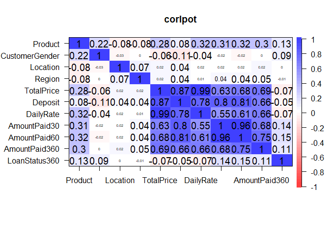
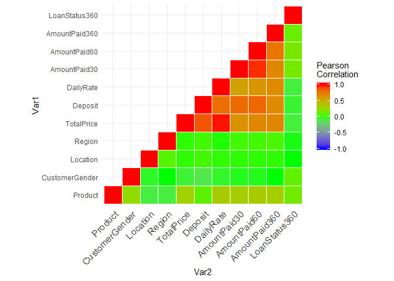
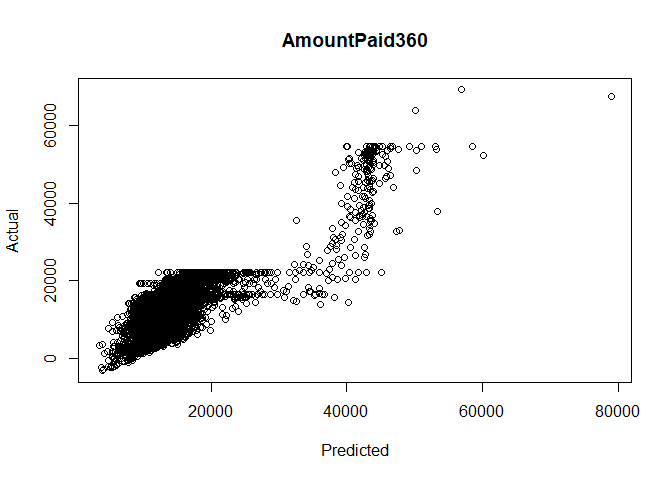
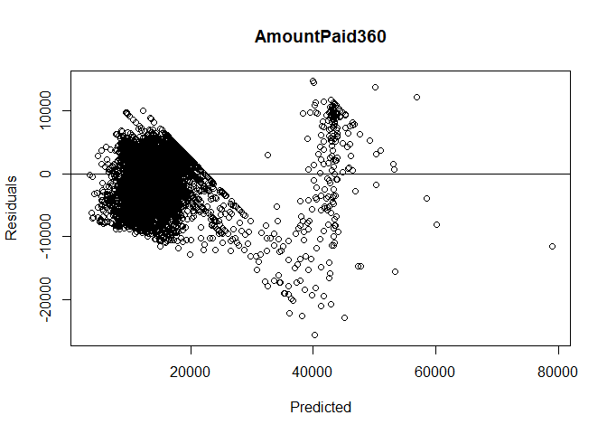
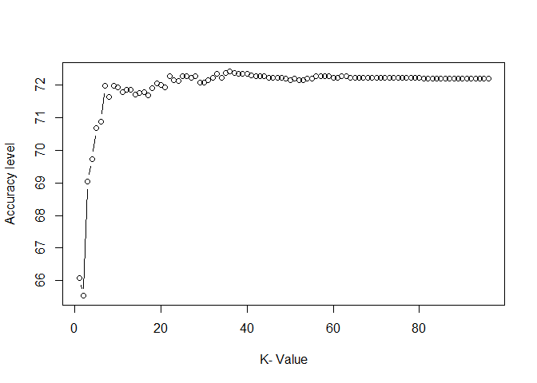

```r
## Set Chunk requirements
knitr::opts_chunk$set(echo = TRUE, message = FALSE, warning = FALSE)
#echo=FALSE indicates that the code will not be shown in the final document 
#(though any results/output would still be displayed).
#include=FALSE to have the chunk evaluated, but neither the code nor its output displayed
# warning=FALSE and message=FALSE suppress any R warnings or messages from being included 
#in the final document
```


```r
#Import relevant packages
library(stats)
library(psych) 
```


```r
#loading dataset

library(tidyverse)
setwd('E:/Documents/Reinp/GitHub Respositories/Loan_Prediction-with-RStudio')
ds_asses<-read.csv('Data Science assessment.csv', header=TRUE,sep=",")
#ds_asses[,-14]  #Reads only the required columns in csv
View(ds_asses)
attach(ds_asses)
```


```r
#summary statistics
names(ds_asses) #display variable names
```

```
##  [1] "Product"        "CustomerGender" "Location"       "Region"        
##  [5] "TotalPrice"     "StartDate"      "Deposit"        "DailyRate"     
##  [9] "TotalDays"      "AmountPaid30"   "AmountPaid60"   "AmountPaid360" 
## [13] "LoanStatus360"
```

```r
summary(ds_asses) #summarizes the dataset
```

```
##    Product          CustomerGender       Location            Region         
##  Length:9195        Length:9195        Length:9195        Length:9195       
##  Class :character   Class :character   Class :character   Class :character  
##  Mode  :character   Mode  :character   Mode  :character   Mode  :character  
##                                                                             
##                                                                             
##                                                                             
##    TotalPrice     StartDate            Deposit       DailyRate     
##  Min.   :13775   Length:9195        Min.   :1000   Min.   : 35.00  
##  1st Qu.:16600   Class :character   1st Qu.:2000   1st Qu.: 40.00  
##  Median :16600   Mode  :character   Median :2000   Median : 40.00  
##  Mean   :19266                      Mean   :2312   Mean   : 46.45  
##  3rd Qu.:20250                      3rd Qu.:2000   3rd Qu.: 50.00  
##  Max.   :69225                      Max.   :9000   Max.   :165.00  
##    TotalDays    AmountPaid30    AmountPaid60   AmountPaid360  
##  Min.   :365   Min.   :-3200   Min.   :-3200   Min.   :-3200  
##  1st Qu.:365   1st Qu.: 2500   1st Qu.: 3438   1st Qu.:11351  
##  Median :365   Median : 3351   Median : 4400   Median :15140  
##  Mean   :365   Mean   : 3580   Mean   : 4736   Mean   :14674  
##  3rd Qu.:365   3rd Qu.: 4601   3rd Qu.: 5668   3rd Qu.:16600  
##  Max.   :365   Max.   :26001   Max.   :33501   Max.   :69225  
##  LoanStatus360     
##  Length:9195       
##  Class :character  
##  Mode  :character  
##                    
##                    
## 
```

```r
describe(ds_asses) 
```

```
##                 vars    n     mean      sd median  trimmed     mad   min   max
## Product*           1 9195      NaN      NA     NA      NaN      NA   Inf  -Inf
## CustomerGender*    2 9195      NaN      NA     NA      NaN      NA   Inf  -Inf
## Location*          3 9195      NaN      NA     NA      NaN      NA   Inf  -Inf
## Region*            4 9195      NaN      NA     NA      NaN      NA   Inf  -Inf
## TotalPrice         5 9195 19266.26 6053.29  16600 18397.93 1482.60 13775 69225
## StartDate*         6 9195      NaN      NA     NA      NaN      NA   Inf  -Inf
## Deposit            7 9195  2311.53 1412.61   2000  2116.56    0.00  1000  9000
## DailyRate          8 9195    46.45   13.38     40    44.61    0.00    35   165
## TotalDays          9 9195   365.00    0.00    365   365.00    0.00   365   365
## AmountPaid30      10 9195  3580.48 2487.32   3351  3465.23 1555.25 -3200 26001
## AmountPaid60      11 9195  4735.67 2756.33   4400  4548.92 1482.60 -3200 33501
## AmountPaid360     12 9195 14673.83 6676.24  15140 14459.55 4062.32 -3200 69225
## LoanStatus360*    13 9195      NaN      NA     NA      NaN      NA   Inf  -Inf
##                 range skew kurtosis    se
## Product*         -Inf   NA       NA    NA
## CustomerGender*  -Inf   NA       NA    NA
## Location*        -Inf   NA       NA    NA
## Region*          -Inf   NA       NA    NA
## TotalPrice      55450 4.88    26.51 63.13
## StartDate*       -Inf   NA       NA    NA
## Deposit          8000 2.63     9.39 14.73
## DailyRate         130 5.02    27.94  0.14
## TotalDays           0  NaN      NaN  0.00
## AmountPaid30    29201 1.39     6.37 25.94
## AmountPaid60    36701 1.83     8.08 28.74
## AmountPaid360   72425 2.18    11.88 69.62
## LoanStatus360*   -Inf   NA       NA    NA
```


```r
#learn more about the dataset
help(ds_asses)
```

```
## No documentation for 'ds_asses' in specified packages and libraries:
## you could try '??ds_asses'
```

```r
??ds_asses
str(ds_asses)
```

```
## 'data.frame':	9195 obs. of  13 variables:
##  $ Product       : chr  "Product B" "Product B" "Product C" "Product B" ...
##  $ CustomerGender: chr  "Male" "Male" "Female" "Male" ...
##  $ Location      : chr  "Location 2" "Location 3" "Location 5" "Location 6" ...
##  $ Region        : chr  "Region 2" "Region 3" "Region 5" "Region 1" ...
##  $ TotalPrice    : int  16600 16600 15600 16600 20250 16600 20250 16600 22250 20250 ...
##  $ StartDate     : chr  "07-04-14" "01-02-15" "12-08-12" "2/20/2015" ...
##  $ Deposit       : int  2000 2000 1000 2000 2000 2000 2000 2000 4000 2000 ...
##  $ DailyRate     : int  40 40 40 40 50 40 50 40 50 50 ...
##  $ TotalDays     : int  365 365 365 365 365 365 365 365 365 365 ...
##  $ AmountPaid30  : int  3121 3061 2160 3041 3470 3201 1851 3971 5750 1951 ...
##  $ AmountPaid60  : int  4241 4171 3280 4241 4820 4141 3251 4131 7450 3251 ...
##  $ AmountPaid360 : int  13621 15041 15340 15321 13720 14141 17701 15351 20250 17351 ...
##  $ LoanStatus360 : chr  "Active" "Active" "Active" "Active" ...
```

```r
class(ds_asses)
```

```
## [1] "data.frame"
```

```r
typeof(ds_asses) 
```

```
## [1] "list"
```

```r
length(ds_asses) 
```

```
## [1] 13
```

```r
#attributes(ds_asses) #columnnames(ds_asses), class(ds_asses), row.names(ds_asses)
```

```r
#distribution of input variables
table(ds_asses$LoanStatus360)
```

```
## 
##           Active          Blocked Finished Payment 
##             6742              849             1604
```

```r
table(ds_asses$CustomerGender)
```

```
## 
##       Female         Male NotSpecified 
##         3290         5358          547
```

```r
table(ds_asses$Product)
```

```
## 
## Product A Product B Product C Product D Product E Product F 
##      3141      3862       999       975       213         5
```

```r
table(ds_asses$Region)
```

```
## 
##  Region 1 Region 10 Region 11 Region 12 Region 13 Region 14 Region 15 Region 16 
##      1232        38        12        39        62        25        22        11 
## Region 17 Region 18  Region 2  Region 3  Region 4  Region 5  Region 6  Region 7 
##        14        16      1364      1941       588       198      2934       622 
##  Region 8  Region 9 
##        44        33
```

```r
table(ds_asses$DailyRate)
```

```
## 
##   35   40   50  125  165 
##   62 4825 4090  213    5
```

```r
table(ds_asses$TotalPrice)
```

```
## 
## 13775 15600 16600 19250 20250 20750 22250 53625 54625 69225 
##    62   937  3888  1008  1289   159  1634     2   211     5
```

```r
table(ds_asses$Deposit)
```

```
## 
## 1000 2000 2500 4000 8000 9000 
## 2007 5177  159 1634    2  216
```


```r
#unique values per column
unique(ds_asses$ DailyRate)
```

```
## [1]  40  50 125 165  35
```

```r
unique(ds_asses$ TotalPrice)
```

```
##  [1] 16600 15600 20250 22250 20750 54625 19250 69225 13775 53625
```

```r
unique(ds_asses$ Deposit)
```

```
## [1] 2000 1000 4000 2500 9000 8000
```

```r
unique(ds_asses$ TotalDays)
```

```
## [1] 365
```


```r
# Distribution of LoanStatus360 accross input variables 
tabLoanStatus360gender <- xtabs(~LoanStatus360+CustomerGender,data= ds_asses)
tabLoanStatus360gender
```

```
##                   CustomerGender
## LoanStatus360      Female Male NotSpecified
##   Active             2534 3891          317
##   Blocked             266  529           54
##   Finished Payment    490  938          176
```

```r
tabLoanStatus360product <- xtabs(~LoanStatus360+Product,data= ds_asses)
tabLoanStatus360product
```

```
##                   Product
## LoanStatus360      Product A Product B Product C Product D Product E Product F
##   Active                2550      2784       591       625       189         3
##   Blocked                253       435        81        73         6         1
##   Finished Payment       338       643       327       277        18         1
```

```r
tabLoanStatus360region <- xtabs(~LoanStatus360+Region,data= ds_asses)
tabLoanStatus360region
```

```
##                   Region
## LoanStatus360      Region 1 Region 10 Region 11 Region 12 Region 13 Region 14
##   Active                857        29         8        25        55        20
##   Blocked               155         4         0         4         0         2
##   Finished Payment      220         5         4        10         7         3
##                   Region
## LoanStatus360      Region 15 Region 16 Region 17 Region 18 Region 2 Region 3
##   Active                  10         8         8        10     1004     1496
##   Blocked                  3         1         2         2      142      142
##   Finished Payment         9         2         4         4      218      303
##                   Region
## LoanStatus360      Region 4 Region 5 Region 6 Region 7 Region 8 Region 9
##   Active                422      126     2133      494       21       16
##   Blocked                54       10      262       54        9        3
##   Finished Payment      112       62      539       74       14       14
```

```r
tabLoanStatus360deposit <- xtabs(~LoanStatus360+Deposit,data= ds_asses)
tabLoanStatus360deposit
```

```
##                   Deposit
## LoanStatus360      1000 2000 2500 4000 8000 9000
##   Active           1473 3696  140 1241    2  190
##   Blocked           175  550   11  106    0    7
##   Finished Payment  359  931    8  287    0   19
```

```r
tabLoanStatus360dailyrate <- xtabs(~LoanStatus360+DailyRate,data= ds_asses)
tabLoanStatus360dailyrate
```

```
##                   DailyRate
## LoanStatus360        35   40   50  125  165
##   Active             55 3339 3156  189    3
##   Blocked             0  520  322    6    1
##   Finished Payment    7  966  612   18    1
```

```r
tabLoanStatus360totalprice <- xtabs(~LoanStatus360+TotalPrice,data= ds_asses)
tabLoanStatus360totalprice
```

```
##                   TotalPrice
## LoanStatus360      13775 15600 16600 19250 20250 20750 22250 53625 54625 69225
##   Active              55   536  2803   882   893   140  1241     2   187     3
##   Blocked              0    81   439    94   111    11   106     0     6     1
##   Finished Payment     7   320   646    32   285     8   287     0    18     1
```


```r
#convert categorical variables to integer data types for regression purpose
ds_asses$Product=as.factor(ds_asses$Product)
is.factor(ds_asses$Product)
```

```
## [1] TRUE
```

```r
ds_asses$Product=as.numeric(ds_asses$Product)
is.integer(ds_asses$Product)
```

```
## [1] FALSE
```

```r
is.numeric(ds_asses$Product)
```

```
## [1] TRUE
```

```r
is.character(ds_asses$Product)
```

```
## [1] FALSE
```

```r
ds_asses$CustomerGender=as.factor(ds_asses$CustomerGender)
is.factor(ds_asses$CustomerGender)
```

```
## [1] TRUE
```

```r
ds_asses$CustomerGender=as.numeric(ds_asses$CustomerGender)
is.integer(ds_asses$CustomerGender)
```

```
## [1] FALSE
```

```r
is.numeric(ds_asses$CustomerGender)
```

```
## [1] TRUE
```

```r
is.character(ds_asses$CustomerGender)
```

```
## [1] FALSE
```

```r
ds_asses$Location=as.factor(ds_asses$Location)
is.factor(ds_asses$Location)
```

```
## [1] TRUE
```

```r
ds_asses$Location=as.numeric(ds_asses$Location)
is.integer(ds_asses$Location)
```

```
## [1] FALSE
```

```r
is.numeric(ds_asses$Location)
```

```
## [1] TRUE
```

```r
is.character(ds_asses$Location)
```

```
## [1] FALSE
```

```r
ds_asses$Region=as.factor(ds_asses$Region)
is.factor(ds_asses$Region)
```

```
## [1] TRUE
```

```r
ds_asses$Region=as.numeric(ds_asses$Region)
is.integer(ds_asses$Region)
```

```
## [1] FALSE
```

```r
is.numeric(ds_asses$Region)
```

```
## [1] TRUE
```

```r
is.character(ds_asses$Region)
```

```
## [1] FALSE
```

```r
ds_asses$LoanStatus360=as.factor(ds_asses$LoanStatus360)
is.factor(ds_asses$LoanStatus360)
```

```
## [1] TRUE
```

```r
ds_asses$LoanStatus360=as.numeric(ds_asses$LoanStatus360)
is.integer(ds_asses$LoanStatus360)
```

```
## [1] FALSE
```

```r
is.numeric(ds_asses$LoanStatus360)
```

```
## [1] TRUE
```

```r
is.character(ds_asses$LoanStatus360)
```

```
## [1] FALSE
```


```r
cor_ds_asses1 <- cor(ds_asses [, c("Product", "CustomerGender", "Location", 
"Region" ,"TotalPrice", "Deposit", "DailyRate", "TotalDays", "AmountPaid30", 
"AmountPaid60", "AmountPaid360", "LoanStatus360")])
cor_ds_asses1
```

```
##                    Product CustomerGender     Location       Region  TotalPrice
## Product         1.00000000    0.215410318 -0.078985609 -0.078691471  0.27738511
## CustomerGender  0.21541032    1.000000000 -0.025930697 -0.001637478 -0.06148111
## Location       -0.07898561   -0.025930697  1.000000000  0.068602167  0.02274191
## Region         -0.07869147   -0.001637478  0.068602167  1.000000000  0.02078652
## TotalPrice      0.27738511   -0.061481106  0.022741907  0.020786524  1.00000000
## Deposit         0.08285576   -0.112198881  0.043638353  0.042175248  0.86554131
## DailyRate       0.31995111   -0.043765449  0.015570866  0.013569760  0.98944434
## TotalDays               NA             NA           NA           NA          NA
## AmountPaid30    0.30512783   -0.019341926  0.016622021  0.037297000  0.63233502
## AmountPaid60    0.31947942   -0.019891374  0.019311098  0.044764604  0.68124418
## AmountPaid360   0.30005376   -0.001685120  0.020024004  0.050803703  0.69030820
## LoanStatus360   0.13397102    0.091076265 -0.002814233 -0.012374521 -0.06902098
##                    Deposit   DailyRate TotalDays AmountPaid30 AmountPaid60
## Product         0.08285576  0.31995111        NA   0.30512783   0.31947942
## CustomerGender -0.11219888 -0.04376545        NA  -0.01934193  -0.01989137
## Location        0.04363835  0.01557087        NA   0.01662202   0.01931110
## Region          0.04217525  0.01356976        NA   0.03729700   0.04476460
## TotalPrice      0.86554131  0.98944434        NA   0.63233502   0.68124418
## Deposit         1.00000000  0.78382689        NA   0.80411920   0.81250190
## DailyRate       0.78382689  1.00000000        NA   0.55135520   0.60957131
## TotalDays               NA          NA         1           NA           NA
## AmountPaid30    0.80411920  0.55135520        NA   1.00000000   0.96219284
## AmountPaid60    0.81250190  0.60957131        NA   0.96219284   1.00000000
## AmountPaid360   0.66266283  0.66416437        NA   0.67589134   0.75124389
## LoanStatus360  -0.04673281 -0.07205609        NA   0.14305659   0.14556791
##                AmountPaid360 LoanStatus360
## Product           0.30005376   0.133971022
## CustomerGender   -0.00168512   0.091076265
## Location          0.02002400  -0.002814233
## Region            0.05080370  -0.012374521
## TotalPrice        0.69030820  -0.069020979
## Deposit           0.66266283  -0.046732808
## DailyRate         0.66416437  -0.072056093
## TotalDays                 NA            NA
## AmountPaid30      0.67589134   0.143056589
## AmountPaid60      0.75124389   0.145567908
## AmountPaid360     1.00000000   0.109930606
## LoanStatus360     0.10993061   1.000000000
```

```r
#Drop TotalDays column as it is not correlated with the rest of the columns
cor_ds_asses <- round(cor(ds_asses [, c("Product", "CustomerGender", "Location", 
"Region" ,"TotalPrice", "Deposit", "DailyRate", "AmountPaid30", "AmountPaid60", 
"AmountPaid360", "LoanStatus360")]),2)
cor_ds_asses
```

```
##                Product CustomerGender Location Region TotalPrice Deposit
## Product           1.00           0.22    -0.08  -0.08       0.28    0.08
## CustomerGender    0.22           1.00    -0.03   0.00      -0.06   -0.11
## Location         -0.08          -0.03     1.00   0.07       0.02    0.04
## Region           -0.08           0.00     0.07   1.00       0.02    0.04
## TotalPrice        0.28          -0.06     0.02   0.02       1.00    0.87
## Deposit           0.08          -0.11     0.04   0.04       0.87    1.00
## DailyRate         0.32          -0.04     0.02   0.01       0.99    0.78
## AmountPaid30      0.31          -0.02     0.02   0.04       0.63    0.80
## AmountPaid60      0.32          -0.02     0.02   0.04       0.68    0.81
## AmountPaid360     0.30           0.00     0.02   0.05       0.69    0.66
## LoanStatus360     0.13           0.09     0.00  -0.01      -0.07   -0.05
##                DailyRate AmountPaid30 AmountPaid60 AmountPaid360 LoanStatus360
## Product             0.32         0.31         0.32          0.30          0.13
## CustomerGender     -0.04        -0.02        -0.02          0.00          0.09
## Location            0.02         0.02         0.02          0.02          0.00
## Region              0.01         0.04         0.04          0.05         -0.01
## TotalPrice          0.99         0.63         0.68          0.69         -0.07
## Deposit             0.78         0.80         0.81          0.66         -0.05
## DailyRate           1.00         0.55         0.61          0.66         -0.07
## AmountPaid30        0.55         1.00         0.96          0.68          0.14
## AmountPaid60        0.61         0.96         1.00          0.75          0.15
## AmountPaid360       0.66         0.68         0.75          1.00          0.11
## LoanStatus360      -0.07         0.14         0.15          0.11          1.00
```


```r
# we create a heatmap to visualize correlations

cor.plot((ds_asses [, c("Product", "CustomerGender", "Location", "Region" ,
"TotalPrice", "Deposit", "DailyRate", "AmountPaid30", "AmountPaid60",
"AmountPaid360", "LoanStatus360")]),numbers=TRUE,main="corlpot")
```

<!-- -->

```r
#or

# Get lower triangle of the correlation matrix
  get_lower_tri <- function(cor_ds_asses){
    cor_ds_asses[upper.tri(cor_ds_asses)]<- NA
    return(cor_ds_asses)
  }
lower_tri <- get_lower_tri(cor_ds_asses)
lower_tri
```

```
##                Product CustomerGender Location Region TotalPrice Deposit
## Product           1.00             NA       NA     NA         NA      NA
## CustomerGender    0.22           1.00       NA     NA         NA      NA
## Location         -0.08          -0.03     1.00     NA         NA      NA
## Region           -0.08           0.00     0.07   1.00         NA      NA
## TotalPrice        0.28          -0.06     0.02   0.02       1.00      NA
## Deposit           0.08          -0.11     0.04   0.04       0.87    1.00
## DailyRate         0.32          -0.04     0.02   0.01       0.99    0.78
## AmountPaid30      0.31          -0.02     0.02   0.04       0.63    0.80
## AmountPaid60      0.32          -0.02     0.02   0.04       0.68    0.81
## AmountPaid360     0.30           0.00     0.02   0.05       0.69    0.66
## LoanStatus360     0.13           0.09     0.00  -0.01      -0.07   -0.05
##                DailyRate AmountPaid30 AmountPaid60 AmountPaid360 LoanStatus360
## Product               NA           NA           NA            NA            NA
## CustomerGender        NA           NA           NA            NA            NA
## Location              NA           NA           NA            NA            NA
## Region                NA           NA           NA            NA            NA
## TotalPrice            NA           NA           NA            NA            NA
## Deposit               NA           NA           NA            NA            NA
## DailyRate           1.00           NA           NA            NA            NA
## AmountPaid30        0.55         1.00           NA            NA            NA
## AmountPaid60        0.61         0.96         1.00            NA            NA
## AmountPaid360       0.66         0.68         0.75          1.00            NA
## LoanStatus360      -0.07         0.14         0.15          0.11             1
```

```r
# Get upper triangle of the correlation matrix
  get_upper_tri <- function(cor_ds_asses){
    cor_ds_asses[lower.tri(cor_ds_asses)]<- NA
    return(cor_ds_asses)
  }
upper_tri <- get_upper_tri(cor_ds_asses)
upper_tri
```

```
##                Product CustomerGender Location Region TotalPrice Deposit
## Product              1           0.22    -0.08  -0.08       0.28    0.08
## CustomerGender      NA           1.00    -0.03   0.00      -0.06   -0.11
## Location            NA             NA     1.00   0.07       0.02    0.04
## Region              NA             NA       NA   1.00       0.02    0.04
## TotalPrice          NA             NA       NA     NA       1.00    0.87
## Deposit             NA             NA       NA     NA         NA    1.00
## DailyRate           NA             NA       NA     NA         NA      NA
## AmountPaid30        NA             NA       NA     NA         NA      NA
## AmountPaid60        NA             NA       NA     NA         NA      NA
## AmountPaid360       NA             NA       NA     NA         NA      NA
## LoanStatus360       NA             NA       NA     NA         NA      NA
##                DailyRate AmountPaid30 AmountPaid60 AmountPaid360 LoanStatus360
## Product             0.32         0.31         0.32          0.30          0.13
## CustomerGender     -0.04        -0.02        -0.02          0.00          0.09
## Location            0.02         0.02         0.02          0.02          0.00
## Region              0.01         0.04         0.04          0.05         -0.01
## TotalPrice          0.99         0.63         0.68          0.69         -0.07
## Deposit             0.78         0.80         0.81          0.66         -0.05
## DailyRate           1.00         0.55         0.61          0.66         -0.07
## AmountPaid30          NA         1.00         0.96          0.68          0.14
## AmountPaid60          NA           NA         1.00          0.75          0.15
## AmountPaid360         NA           NA           NA          1.00          0.11
## LoanStatus360         NA           NA           NA            NA          1.00
```

```r
# Reorder the correlation matrix
reorder_cor_ds_asses <- function(cor_ds_asses){
# Use correlation between variables as distance
dd <- as.dist((1-cor_ds_asses)/2)
hc <- hclust(dd)
cor_ds_asses <-cor_ds_asses[hc$order, hc$order]
}
cor_ds_asses2 <- reorder_cor_ds_asses(cor_ds_asses)

# Melt the correlation matrix
library(reshape2)

melted_cor_ds_asses <- melt(upper_tri, na.rm = TRUE)

library(ggplot2)
ggplot(data = melted_cor_ds_asses, aes(Var2, Var1, fill = value))+
 geom_tile(color = "white")+ 
 scale_fill_gradient2(low = "blue", high = "red", mid = "green", 
   midpoint = 0, limit = c(-1,1), space = "Lab", 
   name="Pearson\nCorrelation") +
  theme_minimal()+ 
 theme(axis.text.x = element_text(angle = 45, vjust = 1, 
    size = 12, hjust = 1))+
 coord_fixed()
```

<!-- -->


```r
#additive model investigates only the main effects of predictors. 
#It assumes that the relationship between a given predictor variable 
#and the outcome is independent of the other predictor variables

#From the correlation table, we see that the AmountPaid360 is most 
#strongly correlated with AmountPaid60. But in addition, we also see that 
#TotalPrice and Deposit are positively correlated. 

#We want to compute the association of the outcome variable AmountPaid360 
#with each predictor while adjusting for the effect of the remaining predictors. 

#Both the multivariate regression and the correlation measure how strongly 
#the features are associated with the outcome (AmountPaid360). When comparing 
#the regression coefficients with the correlation coefficients, we will see 
#that they are slightly different.Ccorrelation computes bivariate relationship 
#between the outcome variable and a single predictor (ignoring all other 
#predictors) while a multiple regression asks if that predictor is related 
#to the outcome after controlling for all the other predictors in the model.

mlm1a <- lm(AmountPaid360 ~ Product + CustomerGender + Location + Region 
+ TotalPrice + Deposit + DailyRate + AmountPaid30 + AmountPaid60, 
data=ds_asses) #multivariate regression
summary(mlm1a)
```

```
## 
## Call:
## lm(formula = AmountPaid360 ~ Product + CustomerGender + Location + 
##     Region + TotalPrice + Deposit + DailyRate + AmountPaid30 + 
##     AmountPaid60, data = ds_asses)
## 
## Residuals:
##    Min     1Q Median     3Q    Max 
## -25651  -2483   1013   2934  14683 
## 
## Coefficients: (1 not defined because of singularities)
##                  Estimate Std. Error t value Pr(>|t|)    
## (Intercept)    -869.22408  236.30752  -3.678 0.000236 ***
## Product         -98.95731   53.05113  -1.865 0.062168 .  
## CustomerGender  174.88070   74.04345   2.362 0.018204 *  
## Location          0.13513    0.16641   0.812 0.416790    
## Region           27.16438    8.84915   3.070 0.002149 ** 
## TotalPrice        0.51187    0.01701  30.093  < 2e-16 ***
## Deposit          -1.18053    0.09674 -12.203  < 2e-16 ***
## DailyRate              NA         NA      NA       NA    
## AmountPaid30     -1.10490    0.06665 -16.577  < 2e-16 ***
## AmountPaid60      2.51516    0.05841  43.064  < 2e-16 ***
## ---
## Signif. codes:  0 '***' 0.001 '**' 0.01 '*' 0.05 '.' 0.1 ' ' 1
## 
## Residual standard error: 3934 on 9186 degrees of freedom
## Multiple R-squared:  0.6531,	Adjusted R-squared:  0.6528 
## F-statistic:  2162 on 8 and 9186 DF,  p-value: < 2.2e-16
```


```r
#DropDailyRate
mlm2a <- lm(AmountPaid360 ~ Product + CustomerGender + Location + 
Region + TotalPrice + Deposit + AmountPaid30 + AmountPaid60, 
data=ds_asses) #multivariate regression
summary(mlm2a)
```

```
## 
## Call:
## lm(formula = AmountPaid360 ~ Product + CustomerGender + Location + 
##     Region + TotalPrice + Deposit + AmountPaid30 + AmountPaid60, 
##     data = ds_asses)
## 
## Residuals:
##    Min     1Q Median     3Q    Max 
## -25651  -2483   1013   2934  14683 
## 
## Coefficients:
##                  Estimate Std. Error t value Pr(>|t|)    
## (Intercept)    -869.22408  236.30752  -3.678 0.000236 ***
## Product         -98.95731   53.05113  -1.865 0.062168 .  
## CustomerGender  174.88070   74.04345   2.362 0.018204 *  
## Location          0.13513    0.16641   0.812 0.416790    
## Region           27.16438    8.84915   3.070 0.002149 ** 
## TotalPrice        0.51187    0.01701  30.093  < 2e-16 ***
## Deposit          -1.18053    0.09674 -12.203  < 2e-16 ***
## AmountPaid30     -1.10490    0.06665 -16.577  < 2e-16 ***
## AmountPaid60      2.51516    0.05841  43.064  < 2e-16 ***
## ---
## Signif. codes:  0 '***' 0.001 '**' 0.01 '*' 0.05 '.' 0.1 ' ' 1
## 
## Residual standard error: 3934 on 9186 degrees of freedom
## Multiple R-squared:  0.6531,	Adjusted R-squared:  0.6528 
## F-statistic:  2162 on 8 and 9186 DF,  p-value: < 2.2e-16
```

```r
#Observed value in data is 13621
newdata <- data.frame(Product =2,  CustomerGender=1, Location=109, 
Region=11, TotalPrice=16600, Deposit=2000, AmountPaid30=3121, 
AmountPaid60=4241)
p <- predict(mlm2a, newdata, interval="confidence")
p
```

```
##       fit      lwr     upr
## 1 12775.6 12615.51 12935.7
```


```r
#Drop Location does not contribute to the model
mlm3a <- lm(AmountPaid360 ~ Product + CustomerGender + Region + 
TotalPrice + Deposit + AmountPaid30 + AmountPaid60, data=ds_asses) 
#multivariate regression
summary(mlm3a)
```

```
## 
## Call:
## lm(formula = AmountPaid360 ~ Product + CustomerGender + Region + 
##     TotalPrice + Deposit + AmountPaid30 + AmountPaid60, data = ds_asses)
## 
## Residuals:
##    Min     1Q Median     3Q    Max 
## -25631  -2490   1004   2931  14661 
## 
## Coefficients:
##                  Estimate Std. Error t value Pr(>|t|)    
## (Intercept)    -825.91773  230.20676  -3.588 0.000335 ***
## Product        -101.57837   52.95186  -1.918 0.055102 .  
## CustomerGender  174.65458   74.04156   2.359 0.018351 *  
## Region           27.59426    8.83313   3.124 0.001790 ** 
## TotalPrice        0.51190    0.01701  30.096  < 2e-16 ***
## Deposit          -1.17973    0.09673 -12.196  < 2e-16 ***
## AmountPaid30     -1.10534    0.06665 -16.584  < 2e-16 ***
## AmountPaid60      2.51566    0.05840  43.076  < 2e-16 ***
## ---
## Signif. codes:  0 '***' 0.001 '**' 0.01 '*' 0.05 '.' 0.1 ' ' 1
## 
## Residual standard error: 3934 on 9187 degrees of freedom
## Multiple R-squared:  0.6531,	Adjusted R-squared:  0.6528 
## F-statistic:  2471 on 7 and 9187 DF,  p-value: < 2.2e-16
```

```r
#Observed value in data is 13621
newdata1 <- data.frame(Product=2, CustomerGender=1, Region=11, 
TotalPrice=16600, Deposit=2000, AmountPaid30=3121, AmountPaid60=4241)
p1 <- predict(mlm3a, newdata1, interval="confidence")
p1
```

```
##        fit      lwr      upr
## 1 12806.45 12664.74 12948.17
```

```r
#Drop Product does not contribute to the model
#Final Model
mlm4a <- lm(AmountPaid360 ~ CustomerGender + Region + TotalPrice + 
Deposit + AmountPaid30 + AmountPaid60, data=ds_asses) 
#multivariate regression
summary(mlm4a)
```

```
## 
## Call:
## lm(formula = AmountPaid360 ~ CustomerGender + Region + TotalPrice + 
##     Deposit + AmountPaid30 + AmountPaid60, data = ds_asses)
## 
## Residuals:
##    Min     1Q Median     3Q    Max 
## -25651  -2488   1009   2920  14711 
## 
## Coefficients:
##                  Estimate Std. Error t value Pr(>|t|)    
## (Intercept)    -794.04659  229.63994  -3.458 0.000547 ***
## CustomerGender  150.33778   72.95903   2.061 0.039371 *  
## Region           29.20511    8.79441   3.321 0.000901 ***
## TotalPrice        0.49460    0.01442  34.292  < 2e-16 ***
## Deposit          -1.07204    0.07879 -13.607  < 2e-16 ***
## AmountPaid30     -1.13537    0.06480 -17.522  < 2e-16 ***
## AmountPaid60      2.51027    0.05834  43.027  < 2e-16 ***
## ---
## Signif. codes:  0 '***' 0.001 '**' 0.01 '*' 0.05 '.' 0.1 ' ' 1
## 
## Residual standard error: 3934 on 9188 degrees of freedom
## Multiple R-squared:  0.653,	Adjusted R-squared:  0.6527 
## F-statistic:  2881 on 6 and 9188 DF,  p-value: < 2.2e-16
```

```r
#Observed value in data is 13621
newdata2 <- data.frame(CustomerGender=1, Region=11, TotalPrice=16600, 
Deposit=2000, AmountPaid30=3121, AmountPaid60=4241)
p2 <- predict(mlm4a, newdata2, interval="confidence")
p2
```

```
##        fit      lwr      upr
## 1 12846.47 12710.76 12982.17
```

```r
sigma(mlm4a) # Residual Standard Error (RSE). The lower the RSE, the more 
```

```
## [1] 3934.305
```

```r
#accurate the model (on the data in hand).
sigma(mlm4a)/mean(ds_asses$AmountPaid360) #The error rate
```

```
## [1] 0.2681171
```

```r
coefficients(mlm4a) # model coefficients
```

```
##    (Intercept) CustomerGender         Region     TotalPrice        Deposit 
##   -794.0465916    150.3377772     29.2051094      0.4946036     -1.0720393 
##   AmountPaid30   AmountPaid60 
##     -1.1353656      2.5102698
```

```r
confint(mlm4a, level=0.95) # CIs for model parameters
```

```
##                        2.5 %       97.5 %
## (Intercept)    -1244.1918987 -343.9012846
## CustomerGender     7.3218671  293.3536872
## Region            11.9661084   46.4441103
## TotalPrice         0.4663306    0.5228766
## Deposit           -1.2264811   -0.9175974
## AmountPaid30      -1.2623783   -1.0083530
## AmountPaid60       2.3959069    2.6246327
```

```r
anova(mlm4a) # anova table
```

```
## Analysis of Variance Table
## 
## Response: AmountPaid360
##                  Df     Sum Sq    Mean Sq    F value Pr(>F)    
## CustomerGender    1 1.1637e+06 1.1637e+06     0.0752 0.7839    
## Region            1 1.0576e+09 1.0576e+09    68.3246 <2e-16 ***
## TotalPrice        1 1.9545e+11 1.9545e+11 12626.8814 <2e-16 ***
## Deposit           1 7.3892e+09 7.3892e+09   477.3748 <2e-16 ***
## AmountPaid30      1 3.5026e+10 3.5026e+10  2262.8199 <2e-16 ***
## AmountPaid60      1 2.8656e+10 2.8656e+10  1851.3177 <2e-16 ***
## Residuals      9188 1.4222e+11 1.5479e+07                      
## ---
## Signif. codes:  0 '***' 0.001 '**' 0.01 '*' 0.05 '.' 0.1 ' ' 1
```

```r
vcov(mlm4a) # covariance matrix for model parameters
```

```
##                  (Intercept) CustomerGender        Region    TotalPrice
## (Intercept)     5.273450e+04  -8.396549e+03 -9.044206e+02 -1.9630901174
## CustomerGender -8.396549e+03   5.323020e+03 -3.338803e+00 -0.0993581245
## Region         -9.044206e+02  -3.338803e+00  7.734168e+01  0.0050764365
## TotalPrice     -1.963090e+00  -9.935812e-02  5.076437e-03  0.0002080335
## Deposit         6.052000e+00   1.030079e+00 -2.701815e-02 -0.0008656772
## AmountPaid30   -7.141471e-01  -2.487421e-01  1.979133e-02  0.0003067156
## AmountPaid60    2.152767e-02  -4.203525e-02 -1.941552e-02 -0.0002178811
##                      Deposit  AmountPaid30  AmountPaid60
## (Intercept)     6.0520004193 -0.7141471317  0.0215276680
## CustomerGender  1.0300788573 -0.2487420904 -0.0420352501
## Region         -0.0270181465  0.0197913250 -0.0194155166
## TotalPrice     -0.0008656772  0.0003067156 -0.0002178811
## Deposit         0.0062075375 -0.0017222672  0.0002120275
## AmountPaid30   -0.0017222672  0.0041983941 -0.0033896522
## AmountPaid60    0.0002120275 -0.0033896522  0.0034037673
```


```r
#fitted(mlm4a) # predicted values
```


```r
#residuals(mlm4a) # residuals
```


```r
#influence(mlm4a) # regression diagnostics $hat $coefficients $sigma 
#$wt. residuals
```


```r
#Understanding Accuracy of the final model with Actual vs Predicted
plot(fitted(mlm4a), ds_asses$AmountPaid360, 
     ylab="Actual", xlab="Predicted", 
     main="AmountPaid360")
```

<!-- -->

```r
#Accuracy of the final model with Residual vs Predicted
#positive values for the residual (on the y-axis) mean the prediction 
#was too low, and negative values mean the prediction was too high; 
#0 means the guess was exactly correct.
plot(fitted(mlm4a), residuals(mlm4a), 
     ylab="Residuals", xlab="Predicted", 
     main="AmountPaid360")
abline(0,0)
```

<!-- -->


```r
#The final multiple regression model equation can be written as AmountPaid360 =
#-643.7088144 + 150.3377772*CustomerGender + 29.2051094*Region + 
#0.4946036*TotalPrice - 1.0720393*Deposit - 1.1353656*AmountPaid30 + 
#2.5102698*AmountPaid60.


#The overall quality of the model can be assessed by examining the R-squared (R2) 
#and Residual Standard Error (RSE).

#R2 represents the correlation coefficient between the observed values of the 
#outcome variable (y) and the predicted values of y. For this reason, the value of 
#R will always be positive and will range from zero to one. R2 represents the 
#proportion of variance, in the outcome variable y, that may be predicted by 
#knowing the value of the x variables. An R2 value close to 1 indicates that the 
#model explains a large portion of the variance in the outcome variable. Problem 
#with the R2, is that, it will always increase when more variables are added to 
#the model, even if those variables are only weakly associated with the response. A 
#solution is to adjust the R2 by taking into account the number of predictor variables.

#The adjusted R2 = 0.6527, meaning that “65.27% of the variance in the measure of 
#AmountPaid360 can be predicted by CustomerGender, Region, TotalPrice, Deposit,  
#AmountPaid30 and AmountPaid60.
#In our multiple regression model, the RSE is 3934.305 corresponding to 26.8% error rate.
```


```r
#Classification model to predict LoanStatus360
ds_asses1 <- ds_asses [, c("Product", "CustomerGender", "Location", "Region" ,
"TotalPrice", "Deposit", "DailyRate", "AmountPaid30", "AmountPaid60", 
"LoanStatus360")]

# see the stucture
head(ds_asses1)
```

```
##   Product CustomerGender Location Region TotalPrice Deposit DailyRate
## 1       2              2      109     11      16600    2000        40
## 2       2              2      220     12      16600    2000        40
## 3       3              1      442     14      15600    1000        40
## 4       2              2      553      1      16600    2000        40
## 5       4              1      660     11      20250    2000        50
## 6       2              1        2     11      16600    2000        40
##   AmountPaid30 AmountPaid60 LoanStatus360
## 1         3121         4241             1
## 2         3061         4171             1
## 3         2160         3280             1
## 4         3041         4241             1
## 5         3470         4820             1
## 6         3201         4141             1
```

```r
tail(ds_asses1)
```

```
##      Product CustomerGender Location Region TotalPrice Deposit DailyRate
## 9190       3              2      447     15      15600    1000        40
## 9191       1              1      221     11      20250    2000        50
## 9192       4              1      520     15      20250    2000        50
## 9193       2              1      763     11      16600    2000        40
## 9194       2              2      331     13      16600    2000        40
## 9195       4              2       67      1      20250    2000        50
##      AmountPaid30 AmountPaid60 LoanStatus360
## 9190         2040         3400             3
## 9191         3601         4301             3
## 9192         4001         5501             3
## 9193         3401         4601             3
## 9194         3400         4600             3
## 9195         6950         6950             3
```

```r
#1.Shuffle your data
#From the head and tail output, you can see if the data is shuffled or not. 
#If not shuffled it will be a big issue! When you will split your data between 
#a train set and test set, you will select only loanstatus 0 and 1 (No 2 are in 
#the top 80 percent of the observations), which means the algorithm will never see 
#the features of 2. This mistake will lead to poor prediction.


shuffle_index <- sample(1:nrow(ds_asses1)) #Generate a random list of index from 
#1 to 9195
head(shuffle_index)
```

```
## [1] 7462 7970 6570  505  890 4030
```

```r
tail(shuffle_index)
```

```
## [1] 2973 5301 6104 9144 4060 5808
```

```r
ds_asses2 <- ds_asses1[shuffle_index, ]
head(ds_asses2)
```

```
##      Product CustomerGender Location Region TotalPrice Deposit DailyRate
## 7462       3              3      548     11      15600    1000        40
## 7970       2              2      243     15      16600    2000        40
## 6570       4              2      423     15      20250    2000        50
## 505        2              2      354     13      16600    2000        40
## 890        1              2      784     15      20750    2500        50
## 4030       1              1      165     12      19250    1000        50
##      AmountPaid30 AmountPaid60 LoanStatus360
## 7462         2040         2640             2
## 7970         3141         4201             3
## 6570         3301         4891             1
## 505          3041         4001             1
## 890          3400         3600             1
## 4030          500         2150             1
```

```r
tail(ds_asses2)
```

```
##      Product CustomerGender Location Region TotalPrice Deposit DailyRate
## 2973       2              1      553      1      16600    2000        40
## 5301       2              1       41      1      16600    2000        40
## 6104       3              2       96     15      15600    1000        40
## 9144       3              2       86     15      15600    1000        40
## 4060       3              2      373     17      15600    1000        40
## 5808       2              2      376      1      16600    2000        40
##      AmountPaid30 AmountPaid60 LoanStatus360
## 2973         3251         3891             1
## 5301         3261         4251             1
## 6104         1600         2000             1
## 9144         2300         3400             3
## 4060         2200         3280             1
## 5808         3391         4351             1
```

```r
#2.Create a train and test set: You train the model on the train set and test the 
#prediction on the test set (i.e. unseen data)

#Split the data 80/20, 80 percent of the data serves to train the model, and 20 
#percent to make predictions

#Function to create two separate data frames. You don't want to touch the test set 
#until you finish building your model
set.seed(1729)
create_train_test <- function(data, size = 0.8, train = TRUE) #Add the arguments in 
  #the function
  {
    n_row = nrow(data) #Count number of rows in the dataset
    total_row = size * n_row #Return the nth row to construct the train set
    train_sample <- 1: total_row #Select the first row to the nth rows
    if (train == TRUE) {
        return (data[train_sample, ]) #If condition sets to true, return the 
      #train set, else the test set
    } else {
        return (data[-train_sample, ])
    }
}

data_train <- create_train_test(ds_asses2, 0.8, train = TRUE)
data_test <- create_train_test(ds_asses2, 0.8, train = FALSE)
dim(data_train)
```

```
## [1] 7356   10
```

```r
dim(data_test)
```

```
## [1] 1839   10
```

```r
#Verify Randomization Process
prop.table(table(data_train$CustomerGender))
```

```
## 
##          1          2          3 
## 0.35440457 0.58401305 0.06158238
```

```r
prop.table(table(data_test$CustomerGender))
```

```
## 
##          1          2          3 
## 0.37139750 0.57748777 0.05111474
```

```r
#3.Buildthemodel

library(rpart)
fit <- rpart(LoanStatus360~., data = data_train, method = 'class')
fit
```

```
## n= 7356 
## 
## node), split, n, loss, yval, (yprob)
##       * denotes terminal node
## 
## 1) root 7356 1977 1 (0.73123980 0.09284937 0.17591082) *
```

```r
#4.Make a Prediction

predict_unseen <-predict(fit, data_test, type = 'class')
table_mat <- table(data_test$LoanStatus360, predict_unseen)
table_mat
```

```
##    predict_unseen
##        1    2    3
##   1 1363    0    0
##   2  166    0    0
##   3  310    0    0
```

```r
library(gmodels)
#understand the relationship of the classes of your test data related to your model 
CrossTable(x = data_test$LoanStatus360, y = predict_unseen, prop.chisq=FALSE)
```

```
## 
##  
##    Cell Contents
## |-------------------------|
## |                       N |
## |         N / Table Total |
## |-------------------------|
## 
##  
## Total Observations in Table:  1839 
## 
##  
##                         | predict_unseen 
## data_test$LoanStatus360 |         1 | Row Total | 
## ------------------------|-----------|-----------|
##                       1 |      1363 |      1363 | 
##                         |     0.741 |           | 
## ------------------------|-----------|-----------|
##                       2 |       166 |       166 | 
##                         |     0.090 |           | 
## ------------------------|-----------|-----------|
##                       3 |       310 |       310 | 
##                         |     0.169 |           | 
## ------------------------|-----------|-----------|
##            Column Total |      1839 |      1839 | 
## ------------------------|-----------|-----------|
## 
## 
```

```r
#5.MeasurePerfomance
#compute an accuracy measure for classification task with the confusion matrix. The
#general idea is to count the number of times True instances are classified as False.

accuracy_Test <- sum(diag(table_mat)) / sum(table_mat)
print(paste('Accuracy for test', accuracy_Test))
```

```
## [1] "Accuracy for test 0.741163675910821"
```


```r
#Knn Classification model to predict LoanStatus360

# see the stucture
head(ds_asses1)
```

```
##   Product CustomerGender Location Region TotalPrice Deposit DailyRate
## 1       2              2      109     11      16600    2000        40
## 2       2              2      220     12      16600    2000        40
## 3       3              1      442     14      15600    1000        40
## 4       2              2      553      1      16600    2000        40
## 5       4              1      660     11      20250    2000        50
## 6       2              1        2     11      16600    2000        40
##   AmountPaid30 AmountPaid60 LoanStatus360
## 1         3121         4241             1
## 2         3061         4171             1
## 3         2160         3280             1
## 4         3041         4241             1
## 5         3470         4820             1
## 6         3201         4141             1
```

```r
tail(ds_asses1)
```

```
##      Product CustomerGender Location Region TotalPrice Deposit DailyRate
## 9190       3              2      447     15      15600    1000        40
## 9191       1              1      221     11      20250    2000        50
## 9192       4              1      520     15      20250    2000        50
## 9193       2              1      763     11      16600    2000        40
## 9194       2              2      331     13      16600    2000        40
## 9195       4              2       67      1      20250    2000        50
##      AmountPaid30 AmountPaid60 LoanStatus360
## 9190         2040         3400             3
## 9191         3601         4301             3
## 9192         4001         5501             3
## 9193         3401         4601             3
## 9194         3400         4600             3
## 9195         6950         6950             3
```

```r
# Division of `LoanStatus360`
table(ds_asses1$LoanStatus360) 
```

```
## 
##    1    2    3 
## 6742  849 1604
```

```r
# Percentual division of `LoanStatus360`
round(prop.table(table(ds_asses1$LoanStatus360)) * 100, digits = 2)
```

```
## 
##     1     2     3 
## 73.32  9.23 17.44
```

```r
##Generate a random number that is 70% of the total number of rows in dataset.
 ran <- sample(1:nrow(ds_asses1), 0.7 * nrow(ds_asses1))

##the normalization function is created
 nor <-function(x) { (x -min(x))/(max(x)-min(x))   }
 
 ##Run nomalization on predictor coulumns of dataset
 ds_asses1_norm <- as.data.frame(lapply(ds_asses[,c("Product", "CustomerGender",
 "Location", "Region" ,"TotalPrice", "Deposit", "DailyRate", "AmountPaid30", 
 "AmountPaid60")], nor))
 summary(ds_asses1_norm)
```

```
##     Product       CustomerGender      Location          Region      
##  Min.   :0.0000   Min.   :0.0000   Min.   :0.0000   Min.   :0.0000  
##  1st Qu.:0.0000   1st Qu.:0.0000   1st Qu.:0.1633   1st Qu.:0.5882  
##  Median :0.2000   Median :0.5000   Median :0.3848   Median :0.6471  
##  Mean   :0.2102   Mean   :0.3508   Mean   :0.4291   Mean   :0.6225  
##  3rd Qu.:0.2000   3rd Qu.:0.5000   3rd Qu.:0.6987   3rd Qu.:0.8235  
##  Max.   :1.0000   Max.   :1.0000   Max.   :1.0000   Max.   :1.0000  
##    TotalPrice         Deposit         DailyRate        AmountPaid30   
##  Min.   :0.00000   Min.   :0.0000   Min.   :0.00000   Min.   :0.0000  
##  1st Qu.:0.05095   1st Qu.:0.1250   1st Qu.:0.03846   1st Qu.:0.1952  
##  Median :0.05095   Median :0.1250   Median :0.03846   Median :0.2243  
##  Mean   :0.09903   Mean   :0.1639   Mean   :0.08809   Mean   :0.2322  
##  3rd Qu.:0.11677   3rd Qu.:0.1250   3rd Qu.:0.11538   3rd Qu.:0.2671  
##  Max.   :1.00000   Max.   :1.0000   Max.   :1.00000   Max.   :1.0000  
##   AmountPaid60   
##  Min.   :0.0000  
##  1st Qu.:0.1809  
##  Median :0.2071  
##  Mean   :0.2162  
##  3rd Qu.:0.2416  
##  Max.   :1.0000
```

```r
 ##extract training set
ds_asses1_train <- ds_asses1_norm[ran,]
##extract testing set
ds_asses1_test <- ds_asses1_norm[-ran,]

dim(ds_asses1_train)
```

```
## [1] 6436    9
```

```r
dim(ds_asses1_test)
```

```
## [1] 2759    9
```

```r
#Verify Randomization Process
prop.table(table(ds_asses1_train$Product))
```

```
## 
##          0        0.2        0.4        0.6        0.8          1 
## 0.34431324 0.41858297 0.11062772 0.10348042 0.02221877 0.00077688
```

```r
prop.table(table(ds_asses1_test$Product))
```

```
## 
##          0        0.2        0.4        0.6        0.8 
## 0.33526640 0.42334179 0.10402320 0.11199710 0.02537151
```

```r
prop.table(table(ds_asses1_train$CustomerGender))
```

```
## 
##          0        0.5          1 
## 0.35783095 0.58141703 0.06075202
```

```r
prop.table(table(ds_asses1_test$CustomerGender))
```

```
## 
##          0        0.5          1 
## 0.35773831 0.58571946 0.05654223
```

```r
##extract 10th column of train dataset because it will be used as 'cl' argument 
#in knn function.
ds_asses1_target_category <- ds_asses1[ran,10]

 ##extract 10th column if test dataset to measure the accuracy
 ds_asses1_test_category <- ds_asses1[-ran,10]
 
 ##load the package class
 library(class)
 
 #To choose the appropiate number of k, the most widely used method is to do the 
 #square root of the rows

sqrt(nrow(ds_asses1))
```

```
## [1] 95.89056
```

```r
##run knn function
 prk <- knn(ds_asses1_train,ds_asses1_test,cl=ds_asses1_target_category,k=96,prob = TRUE)
 prk
```

```
##    [1] 1 1 1 1 1 1 1 1 1 1 1 1 1 1 1 1 1 1 1 1 1 1 1 1 1 1 1 1 1 1 1 1 1 1 1 1 1
##   [38] 1 1 1 1 1 1 1 1 1 1 1 1 1 1 1 1 1 1 1 1 1 1 1 1 1 1 1 1 1 1 1 1 1 1 1 1 1
##   [75] 1 1 1 1 1 1 1 1 1 1 1 1 1 1 1 1 1 1 1 1 1 1 1 1 1 1 1 1 1 1 1 1 1 1 1 1 1
##  [112] 1 1 1 1 1 1 1 1 1 1 1 1 1 1 1 1 1 1 1 1 1 1 1 1 1 1 1 1 1 1 1 1 1 1 1 1 1
##  [149] 1 1 1 1 1 1 1 1 1 1 1 1 1 1 1 1 1 1 1 1 1 1 1 1 1 1 1 1 1 1 1 1 1 1 1 1 1
##  [186] 1 1 1 1 1 1 1 1 1 1 1 1 1 1 1 1 1 1 1 1 1 1 1 1 1 1 1 1 1 1 1 1 1 1 1 1 1
##  [223] 1 1 1 1 1 1 1 1 1 1 1 1 1 1 1 1 1 1 1 1 1 1 1 1 1 1 1 1 1 1 1 1 1 1 1 1 1
##  [260] 1 1 1 1 1 1 1 1 1 1 1 1 1 1 1 1 1 1 1 1 1 1 1 1 1 1 1 1 1 1 1 1 1 1 1 1 1
##  [297] 1 1 1 1 1 1 1 1 1 1 1 1 1 1 1 1 1 1 1 1 1 1 1 1 1 1 1 1 1 1 1 1 1 1 1 1 1
##  [334] 1 1 1 1 1 1 1 1 1 1 1 1 1 1 1 1 1 1 1 1 1 1 1 1 1 1 1 1 1 1 1 1 1 1 1 1 1
##  [371] 1 1 1 1 1 1 1 1 1 1 1 1 1 1 1 1 1 1 1 1 1 1 1 1 1 1 1 1 1 1 1 1 1 1 1 1 1
##  [408] 1 1 1 1 1 1 1 1 1 1 1 1 1 1 1 1 1 1 1 1 1 1 1 1 1 1 1 1 1 1 1 1 1 1 1 1 1
##  [445] 1 1 1 1 1 1 1 1 1 1 1 1 1 1 1 1 1 1 1 1 1 1 1 1 1 1 1 1 1 1 1 1 1 1 1 1 1
##  [482] 1 1 1 1 1 1 1 1 1 1 1 1 1 1 1 1 1 1 1 1 1 1 1 1 1 1 1 1 1 1 1 1 1 1 1 1 1
##  [519] 1 1 1 1 1 1 1 1 1 1 1 1 1 1 1 1 1 1 1 1 1 1 1 1 1 1 1 1 1 1 1 1 1 1 1 1 1
##  [556] 1 1 1 1 1 1 1 1 1 1 1 1 1 1 1 1 1 1 1 1 1 1 1 1 1 1 1 1 1 1 1 1 1 1 1 1 1
##  [593] 1 1 1 1 1 1 1 1 1 1 1 1 1 1 1 1 1 1 1 1 1 1 1 1 1 1 1 1 1 1 1 1 1 1 1 1 1
##  [630] 1 1 1 1 1 1 1 1 1 1 1 1 1 1 1 1 1 1 1 1 1 1 1 1 1 1 1 1 1 1 1 1 1 1 1 1 1
##  [667] 1 1 1 1 1 1 1 1 1 1 1 1 1 1 1 1 1 1 1 1 1 1 1 1 1 1 1 1 1 1 1 1 1 1 1 1 1
##  [704] 1 1 1 1 1 1 1 1 1 1 1 1 1 1 1 1 1 1 1 1 1 1 1 1 1 1 1 1 1 1 1 1 1 1 1 1 1
##  [741] 1 1 1 1 1 1 1 1 1 1 1 1 1 1 1 1 1 1 1 1 1 1 1 1 1 1 1 1 1 1 1 1 1 1 1 1 1
##  [778] 1 1 1 1 1 1 1 1 1 1 1 1 1 1 1 1 1 1 1 1 1 1 1 1 1 1 1 1 1 1 1 1 1 1 1 1 1
##  [815] 1 1 1 1 1 1 1 1 1 1 1 1 1 1 1 1 1 1 1 1 1 1 1 1 1 1 1 1 1 1 1 1 1 1 1 1 1
##  [852] 1 1 1 1 1 1 1 1 1 1 1 1 1 1 1 1 1 1 1 1 1 1 1 1 1 1 1 1 1 1 1 1 1 1 1 1 1
##  [889] 1 1 1 1 1 1 1 1 1 1 1 1 1 1 1 1 1 1 1 1 1 1 1 1 1 1 1 1 1 1 1 1 1 1 1 1 1
##  [926] 1 1 1 1 1 1 1 1 1 1 1 1 1 1 1 1 1 1 1 1 1 1 1 1 1 1 1 1 1 1 1 1 1 1 1 1 1
##  [963] 1 1 1 1 1 1 1 1 1 1 1 1 1 1 1 1 1 1 1 1 1 1 1 1 1 1 1 1 1 1 1 1 1 1 1 1 1
## [1000] 1 1 1 1 1 1 1 1 1 1 1 1 1 1 1 1 1 1 1 1 1 1 1 1 1 1 1 1 1 1 1 1 1 1 1 1 1
## [1037] 1 1 1 1 1 1 1 1 1 1 1 1 1 1 1 1 1 1 1 1 1 1 1 1 1 1 1 1 1 1 1 1 1 1 1 1 1
## [1074] 1 1 1 1 1 1 1 1 1 1 1 1 1 1 1 1 1 1 1 1 1 1 1 1 1 1 1 1 1 1 1 1 1 1 1 1 1
## [1111] 1 1 1 1 1 1 1 1 1 1 1 1 1 1 1 1 1 1 1 1 1 1 1 1 1 1 1 1 1 1 1 1 1 1 1 1 1
## [1148] 1 1 1 1 1 1 1 1 1 1 1 1 1 1 1 1 1 1 1 1 1 1 1 1 1 1 1 1 1 1 1 1 1 1 1 1 1
## [1185] 1 1 1 1 1 1 1 1 1 1 1 1 1 1 1 1 1 1 1 1 1 1 1 1 1 1 1 1 1 1 1 1 1 1 1 1 1
## [1222] 1 1 1 1 1 1 1 1 1 1 1 1 1 1 1 1 1 1 1 1 1 1 1 1 1 1 1 1 1 1 1 1 1 1 1 1 1
## [1259] 1 1 1 1 1 1 1 1 1 1 1 1 1 1 1 1 1 1 1 1 1 1 1 1 1 1 1 1 1 1 1 1 1 1 1 1 1
## [1296] 1 1 1 1 1 1 1 1 1 1 1 1 1 1 1 1 1 1 1 1 1 1 1 1 1 1 1 1 1 1 1 1 1 1 1 1 1
## [1333] 1 1 1 1 1 1 1 1 1 1 1 1 1 1 1 1 1 1 1 1 1 1 1 1 1 1 1 1 1 1 1 1 1 1 1 1 1
## [1370] 1 1 1 1 1 1 1 1 1 1 1 1 1 1 1 1 1 1 1 1 1 1 1 1 1 1 1 1 1 1 1 1 1 1 1 1 1
## [1407] 1 1 1 1 1 1 1 1 1 1 1 1 1 1 1 1 1 1 1 1 1 1 1 1 1 1 1 1 1 1 1 1 1 1 1 1 1
## [1444] 1 1 1 1 1 1 1 1 1 1 1 1 1 1 1 1 1 1 1 1 1 1 1 1 1 1 1 1 1 1 1 1 1 1 1 1 1
## [1481] 1 1 1 1 1 1 1 1 1 1 1 1 1 1 1 1 1 1 1 1 1 1 1 1 1 1 1 1 1 1 1 1 1 1 1 1 1
## [1518] 1 1 1 1 1 1 1 1 1 1 1 1 1 1 1 1 1 1 1 1 1 1 1 1 1 1 1 1 1 1 1 1 1 1 1 1 1
## [1555] 1 1 1 1 1 1 1 1 1 1 1 1 1 1 1 1 1 1 1 1 1 1 1 1 1 1 1 1 1 1 1 1 1 1 1 1 1
## [1592] 1 1 1 1 1 1 1 1 1 1 1 1 1 1 1 1 1 1 1 1 1 1 1 1 1 1 1 1 1 1 1 1 1 1 1 1 1
## [1629] 1 1 1 1 1 1 1 1 1 1 1 1 1 1 1 1 1 1 1 1 1 1 1 1 1 1 1 1 1 1 1 1 1 1 1 1 1
## [1666] 1 1 1 1 1 1 1 1 1 1 1 1 1 1 1 1 1 1 1 1 1 1 1 1 1 1 1 1 1 1 1 1 1 1 1 1 1
## [1703] 1 1 1 1 1 1 1 1 1 1 1 1 1 1 1 1 1 1 1 1 1 1 1 1 1 1 1 1 1 1 1 1 1 1 1 1 1
## [1740] 1 1 1 1 1 1 1 1 1 1 1 1 1 1 1 1 1 1 1 1 1 1 1 1 1 1 1 1 1 1 1 1 1 1 1 1 1
## [1777] 1 1 1 1 1 1 1 1 1 1 1 1 1 1 1 1 1 1 1 1 1 1 1 1 1 1 1 1 1 1 1 1 1 1 1 1 1
## [1814] 1 1 1 1 1 1 1 1 1 1 1 1 1 1 1 1 1 1 1 1 1 1 1 1 1 1 1 1 1 1 1 1 1 1 1 1 1
## [1851] 1 1 1 1 1 1 1 1 1 1 1 1 1 1 1 1 1 1 1 1 1 1 1 1 1 1 1 1 1 1 1 1 1 1 1 1 1
## [1888] 1 1 1 1 1 1 1 1 1 1 1 1 1 1 1 1 1 1 1 1 1 1 1 1 1 1 1 1 1 1 1 1 1 1 1 1 1
## [1925] 1 1 1 1 1 1 1 1 1 1 1 1 1 1 1 1 1 1 1 1 1 1 1 1 1 1 1 1 1 1 1 1 1 1 1 1 1
## [1962] 1 1 1 1 1 1 1 1 1 1 1 1 1 1 1 1 1 1 1 1 1 1 1 1 1 1 1 1 1 1 1 1 1 1 1 1 1
## [1999] 1 1 1 1 1 1 1 1 1 1 1 1 1 1 1 1 1 1 1 1 1 1 1 1 1 1 1 1 1 1 1 1 1 1 1 1 1
## [2036] 1 1 1 1 1 1 1 1 1 1 1 1 1 1 1 1 1 1 1 1 1 1 1 1 1 1 1 1 1 1 1 1 1 1 1 1 1
## [2073] 1 1 1 1 1 1 1 1 1 1 1 1 1 1 1 1 1 1 1 1 1 1 1 1 1 1 1 1 1 1 1 1 1 1 1 1 1
## [2110] 1 1 1 1 1 1 1 1 1 1 1 1 1 1 1 1 1 1 1 1 1 1 1 1 1 1 1 1 1 1 1 1 1 1 1 1 1
## [2147] 1 1 1 1 1 1 1 1 1 1 1 1 1 1 1 1 1 1 1 1 1 1 1 1 1 1 1 1 1 1 1 1 1 1 1 1 1
## [2184] 1 1 1 1 1 1 1 1 1 1 1 1 1 1 1 1 1 1 1 1 1 1 1 1 1 1 1 1 1 1 1 1 1 1 1 1 1
## [2221] 1 1 1 1 1 1 1 1 1 1 1 1 1 1 1 1 1 1 1 1 1 1 1 1 1 1 1 1 1 1 1 1 1 1 1 1 1
## [2258] 1 1 1 1 1 1 1 1 1 1 1 1 1 1 1 1 1 1 1 1 1 1 1 1 1 1 1 1 1 1 1 1 1 1 1 1 1
## [2295] 1 1 1 1 1 1 1 1 1 1 1 1 1 1 1 1 1 1 1 1 1 1 1 1 1 1 1 1 1 1 1 1 1 1 1 1 1
## [2332] 1 1 1 1 1 1 1 1 1 1 1 1 1 1 1 1 1 1 1 1 1 1 1 1 1 1 1 1 1 1 1 1 1 1 1 1 1
## [2369] 1 1 1 1 1 1 1 1 1 1 1 1 1 1 1 1 1 1 1 1 1 1 1 1 1 1 1 1 1 1 1 1 1 1 1 1 1
## [2406] 1 1 1 1 1 1 1 1 1 1 1 1 1 1 1 1 1 1 1 1 1 1 1 1 1 1 1 1 1 1 1 1 1 1 1 1 1
## [2443] 1 1 1 1 1 1 1 1 1 1 1 1 1 1 1 1 1 1 1 1 1 1 1 1 1 1 1 1 1 1 1 1 1 1 1 1 1
## [2480] 1 1 1 1 1 1 1 1 1 1 1 1 1 1 1 1 1 1 1 1 1 1 1 1 1 1 1 1 1 1 1 1 1 1 1 1 1
## [2517] 1 1 1 1 1 1 1 1 1 1 1 1 1 1 1 1 1 1 1 1 1 1 1 1 1 1 1 1 1 1 1 1 1 1 1 1 1
## [2554] 1 1 1 1 1 1 1 1 1 1 1 1 1 1 1 1 1 1 1 1 1 1 1 1 1 1 1 1 1 1 1 1 1 1 1 1 1
## [2591] 1 1 1 1 1 1 1 1 1 1 1 1 1 1 1 1 1 1 1 1 1 1 1 1 1 1 1 1 1 1 1 1 1 1 1 1 1
## [2628] 1 1 1 1 1 1 1 1 1 1 1 1 1 1 1 1 1 1 1 1 1 1 1 1 1 1 1 1 1 1 1 1 1 1 1 1 1
## [2665] 1 1 1 1 1 1 1 1 1 1 1 1 1 1 1 1 1 1 1 1 1 1 1 1 1 1 1 1 1 1 1 1 1 1 1 1 1
## [2702] 1 1 1 1 1 1 1 1 1 1 1 1 1 1 1 1 1 1 1 1 1 1 1 1 1 1 1 1 1 1 1 1 1 1 1 1 1
## [2739] 1 1 1 1 1 1 1 1 1 1 1 1 1 1 1 1 1 1 1 1 1
## attr(,"prob")
##    [1] 0.6979167 0.7500000 0.8437500 0.7500000 0.8333333 0.8645833 0.5773196
##    [8] 0.7755102 0.6391753 0.7083333 0.7708333 0.8229167 0.5773196 0.7812500
##   [15] 0.6562500 0.7708333 0.7083333 0.9375000 0.6250000 0.5625000 0.7395833
##   [22] 0.7395833 0.7708333 0.6145833 0.7187500 0.7812500 0.8333333 0.8125000
##   [29] 0.7395833 0.8333333 0.7395833 0.7187500 0.8333333 0.6082474 0.8854167
##   [36] 0.8020833 0.5625000 0.6224490 0.8854167 0.8333333 0.8854167 0.8125000
##   [43] 0.8229167 0.8333333 0.6875000 0.8333333 0.8958333 0.7916667 0.8229167
##   [50] 0.6082474 0.8125000 0.8333333 0.7708333 0.7604167 0.7916667 0.8541667
##   [57] 0.8541667 0.8125000 0.8958333 0.7087379 0.5625000 0.7395833 0.9375000
##   [64] 0.7291667 0.8645833 0.7916667 0.8437500 0.8333333 0.7395833 0.8333333
##   [71] 0.7500000 0.6666667 0.7708333 0.9166667 0.7708333 0.9166667 0.9062500
##   [78] 0.7500000 0.8958333 0.6770833 0.6979167 0.8645833 0.8762887 0.5520833
##   [85] 0.8333333 0.6458333 0.6875000 0.8750000 0.7708333 0.6979167 0.6701031
##   [92] 0.8333333 0.8020833 0.8437500 0.8854167 0.8437500 0.6875000 0.6597938
##   [99] 0.7938144 0.7083333 0.7708333 0.6041667 0.7500000 0.8333333 0.6666667
##  [106] 0.7500000 0.9583333 0.8125000 0.8437500 0.7395833 0.8020833 0.8020833
##  [113] 0.6979167 0.6185567 0.7083333 0.6250000 0.8645833 0.5937500 0.8229167
##  [120] 0.7083333 0.8437500 0.8333333 0.6354167 0.8125000 0.8645833 0.7708333
##  [127] 0.6562500 0.6875000 0.9062500 0.6597938 0.8437500 0.7395833 0.8854167
##  [134] 0.7291667 0.7812500 0.8333333 0.7187500 0.6458333 0.8437500 0.6979167
##  [141] 0.7395833 0.8041237 0.8125000 0.8125000 0.7708333 0.7604167 0.7500000
##  [148] 0.7291667 0.5625000 0.8229167 0.6666667 0.8958333 0.8020833 0.8333333
##  [155] 0.7604167 0.7812500 0.8125000 0.7083333 0.7916667 0.7916667 0.8958333
##  [162] 0.7916667 0.8854167 0.7708333 0.7083333 0.6979167 0.7291667 0.7812500
##  [169] 0.8750000 0.8020833 0.6354167 0.8333333 0.6145833 0.7187500 0.7812500
##  [176] 0.7812500 0.7812500 0.8854167 0.7708333 0.8645833 0.6666667 0.6458333
##  [183] 0.7916667 0.8020833 0.7500000 0.7395833 0.7083333 0.7395833 0.7395833
##  [190] 0.8541667 0.7916667 0.7916667 0.7500000 0.8750000 0.7083333 0.8645833
##  [197] 0.6770833 0.7916667 0.7291667 0.8333333 0.7525773 0.8020833 0.7604167
##  [204] 0.8854167 0.6875000 0.7916667 0.7708333 0.7604167 0.7083333 0.7291667
##  [211] 0.7604167 0.7400000 0.6562500 0.7708333 0.6979167 0.7708333 0.7812500
##  [218] 0.6979167 0.8333333 0.5833333 0.7187500 0.8020833 0.5208333 0.6458333
##  [225] 0.8645833 0.5625000 0.6494845 0.8229167 0.7708333 0.8333333 0.8333333
##  [232] 0.7291667 0.6562500 0.6804124 0.7916667 0.7604167 0.8854167 0.6701031
##  [239] 0.7187500 0.8229167 0.7083333 0.7500000 0.7708333 0.7916667 0.8229167
##  [246] 0.7916667 0.8437500 0.5416667 0.8229167 0.7708333 0.7291667 0.7916667
##  [253] 0.8437500 0.7604167 0.6562500 0.7812500 0.7812500 0.7604167 0.6145833
##  [260] 0.7083333 0.6979167 0.8645833 0.8247423 0.6875000 0.9166667 0.6875000
##  [267] 0.7812500 0.8229167 0.7083333 0.8229167 0.6770833 0.8125000 0.6354167
##  [274] 0.7604167 0.6145833 0.7272727 0.8958333 0.6562500 0.8645833 0.8865979
##  [281] 0.5416667 0.7938144 0.7708333 0.7916667 0.6145833 0.7500000 0.6562500
##  [288] 0.5416667 0.8437500 0.7291667 0.8333333 0.7916667 0.7395833 0.8958333
##  [295] 0.6875000 0.7812500 0.8125000 0.6666667 0.6354167 0.7812500 0.8020833
##  [302] 0.7708333 0.6770833 0.7604167 0.8645833 0.8125000 0.6770833 0.8437500
##  [309] 0.5729167 0.6145833 0.7395833 0.8041237 0.9479167 0.7187500 0.7812500
##  [316] 0.8229167 0.6354167 0.6979167 0.6354167 0.7291667 0.7083333 0.8125000
##  [323] 0.7812500 0.8958333 0.7083333 0.8020833 0.7187500 0.8333333 0.8865979
##  [330] 0.7291667 0.8125000 0.8020833 0.7916667 0.8020833 0.5729167 0.7604167
##  [337] 0.7708333 0.8333333 0.7395833 0.8041237 0.8125000 0.8541667 0.8333333
##  [344] 0.7812500 0.6979167 0.6979167 0.9062500 0.6458333 0.8645833 0.7916667
##  [351] 0.7395833 0.9062500 0.7604167 0.6666667 0.6875000 0.7812500 0.7187500
##  [358] 0.8229167 0.5000000 0.8229167 0.5000000 0.7604167 0.8437500 0.8645833
##  [365] 0.6354167 0.7083333 0.7187500 0.6979167 0.9062500 0.6562500 0.7010309
##  [372] 0.9062500 0.6597938 0.6288660 0.7187500 0.7500000 0.8125000 0.9166667
##  [379] 0.5729167 0.7604167 0.8865979 0.5729167 0.8144330 0.8229167 0.6770833
##  [386] 0.7291667 0.7812500 0.7604167 0.7604167 0.7083333 0.7291667 0.7916667
##  [393] 0.7395833 0.7500000 0.7083333 0.7708333 0.7187500 0.6875000 0.7812500
##  [400] 0.7500000 0.8958333 0.7395833 0.6770833 0.7500000 0.8333333 0.7400000
##  [407] 0.7812500 0.8020833 0.5416667 0.7395833 0.7187500 0.6224490 0.7395833
##  [414] 0.7291667 0.6979167 0.9062500 0.7291667 0.7916667 0.6770833 0.7187500
##  [421] 0.7395833 0.7708333 0.7604167 0.7812500 0.6562500 0.6979167 0.7040816
##  [428] 0.6145833 0.8020833 0.6562500 0.7812500 0.8645833 0.7916667 0.7938144
##  [435] 0.6875000 0.7422680 0.5937500 0.7395833 0.7187500 0.5520833 0.7500000
##  [442] 0.7812500 0.7291667 0.8541667 0.6979167 0.9166667 0.7187500 0.6458333
##  [449] 0.8020833 0.7708333 0.8645833 0.8333333 0.5312500 0.7916667 0.5520833
##  [456] 0.7500000 0.5729167 0.9062500 0.7812500 0.5773196 0.6875000 0.8854167
##  [463] 0.6770833 0.6354167 0.8020833 0.8958333 0.7604167 0.8020833 0.6458333
##  [470] 0.8958333 0.7708333 0.7604167 0.7604167 0.6979167 0.8020833 0.7708333
##  [477] 0.9166667 0.7708333 0.9062500 0.7083333 0.8229167 0.7708333 0.7916667
##  [484] 0.7291667 0.7708333 0.9375000 0.7395833 0.7395833 0.8453608 0.8020833
##  [491] 0.8854167 0.7708333 0.8333333 0.6875000 0.8247423 0.8333333 0.8645833
##  [498] 0.6562500 0.6250000 0.8333333 0.7916667 0.6458333 0.7812500 0.7604167
##  [505] 0.6770833 0.8750000 0.8020833 0.7708333 0.5520833 0.7604167 0.9166667
##  [512] 0.7395833 0.6875000 0.7604167 0.6770833 0.7187500 0.6666667 0.9062500
##  [519] 0.7812500 0.8125000 0.7187500 0.7346939 0.8969072 0.8750000 0.7291667
##  [526] 0.8645833 0.7916667 0.5833333 0.6770833 0.7604167 0.8020833 0.6666667
##  [533] 0.7500000 0.7708333 0.6979167 0.8229167 0.6875000 0.6145833 0.9072165
##  [540] 0.8541667 0.7291667 0.7187500 0.9166667 0.7291667 0.7083333 0.8020833
##  [547] 0.8333333 0.7916667 0.6979167 0.7916667 0.8645833 0.7604167 0.7395833
##  [554] 0.7187500 0.7395833 0.7187500 0.8125000 0.6770833 0.7604167 0.8854167
##  [561] 0.8854167 0.8541667 0.7187500 0.7916667 0.8333333 0.7395833 0.6562500
##  [568] 0.7916667 0.8229167 0.6979167 0.9278351 0.8020833 0.6354167 0.7812500
##  [575] 0.8333333 0.8020833 0.7395833 0.7395833 0.8125000 0.7708333 0.6979167
##  [582] 0.6770833 0.7916667 0.8645833 0.7708333 0.7291667 0.7187500 0.8854167
##  [589] 0.8333333 0.8333333 0.6666667 0.7812500 0.8333333 0.7291667 0.6562500
##  [596] 0.6979167 0.7708333 0.7916667 0.7708333 0.8541667 0.7938144 0.7708333
##  [603] 0.7812500 0.7708333 0.8750000 0.8645833 0.6562500 0.6250000 0.6770833
##  [610] 0.7395833 0.8958333 0.7916667 0.7812500 0.6562500 0.7187500 0.7422680
##  [617] 0.6250000 0.6979167 0.6875000 0.7525773 0.8229167 0.8229167 0.8020833
##  [624] 0.7916667 0.7395833 0.7812500 0.6666667 0.6666667 0.7500000 0.6041667
##  [631] 0.7083333 0.7812500 0.6562500 0.8645833 0.6979167 0.8645833 0.8125000
##  [638] 0.8437500 0.7500000 0.8125000 0.8333333 0.8125000 0.8229167 0.8020833
##  [645] 0.8020833 0.8020833 0.8958333 0.6666667 0.6562500 0.7395833 0.7500000
##  [652] 0.7500000 0.9375000 0.8020833 0.8854167 0.6875000 0.8125000 0.7708333
##  [659] 0.7653061 0.7395833 0.5937500 0.8020833 0.8854167 0.7083333 0.5520833
##  [666] 0.8125000 0.8229167 0.7272727 0.7187500 0.6145833 0.8020833 0.8958333
##  [673] 0.8958333 0.7083333 0.7604167 0.7708333 0.8229167 0.8333333 0.8645833
##  [680] 0.7291667 0.6145833 0.8437500 0.8125000 0.7187500 0.7083333 0.8229167
##  [687] 0.8854167 0.7916667 0.8750000 0.7291667 0.6666667 0.8125000 0.7708333
##  [694] 0.6875000 0.8125000 0.8020833 0.7395833 0.7422680 0.7500000 0.6041667
##  [701] 0.6354167 0.6770833 0.6562500 0.5729167 0.7395833 0.6562500 0.7395833
##  [708] 0.6875000 0.7500000 0.6666667 0.8125000 0.6666667 0.8659794 0.9270833
##  [715] 0.8958333 0.7604167 0.5625000 0.7395833 0.7812500 0.8750000 0.5520833
##  [722] 0.7604167 0.7083333 0.8020833 0.8144330 0.6875000 0.6979167 0.7395833
##  [729] 0.7812500 0.8229167 0.7187500 0.7422680 0.7291667 0.8854167 0.6979167
##  [736] 0.7216495 0.6875000 0.5416667 0.6804124 0.8229167 0.7395833 0.6562500
##  [743] 0.7604167 0.8750000 0.7187500 0.9062500 0.5833333 0.7187500 0.7083333
##  [750] 0.8125000 0.8750000 0.7083333 0.7604167 0.6979167 0.6875000 0.8958333
##  [757] 0.7916667 0.6979167 0.6458333 0.8854167 0.8333333 0.8020833 0.8854167
##  [764] 0.7812500 0.6666667 0.8750000 0.7604167 0.7395833 0.6145833 0.7040816
##  [771] 0.8125000 0.7291667 0.6666667 0.6979167 0.6354167 0.5625000 0.8958333
##  [778] 0.8333333 0.8854167 0.7812500 0.7187500 0.7187500 0.7916667 0.9175258
##  [785] 0.8854167 0.7187500 0.8333333 0.7291667 0.8041237 0.8125000 0.8333333
##  [792] 0.8041237 0.8020833 0.8958333 0.6562500 0.7812500 0.6979167 0.8645833
##  [799] 0.8125000 0.7083333 0.6666667 0.7083333 0.6979167 0.8020833 0.6804124
##  [806] 0.8125000 0.6875000 0.8020833 0.7812500 0.7500000 0.6391753 0.7187500
##  [813] 0.8229167 0.8333333 0.5670103 0.8750000 0.8020833 0.7916667 0.7812500
##  [820] 0.6875000 0.6562500 0.8020833 0.8750000 0.8125000 0.7916667 0.7708333
##  [827] 0.7604167 0.8125000 0.7291667 0.7708333 0.7500000 0.6875000 0.7291667
##  [834] 0.5729167 0.8958333 0.7916667 0.6458333 0.8229167 0.8125000 0.6875000
##  [841] 0.6666667 0.6666667 0.6597938 0.7083333 0.7187500 0.8437500 0.8125000
##  [848] 0.8333333 0.8020833 0.8437500 0.6979167 0.7346939 0.7708333 0.8125000
##  [855] 0.8229167 0.8125000 0.8125000 0.8333333 0.7500000 0.8125000 0.5520833
##  [862] 0.7500000 0.7187500 0.7291667 0.7604167 0.7708333 0.6458333 0.6770833
##  [869] 0.7500000 0.6875000 0.8437500 0.7604167 0.6354167 0.7500000 0.7812500
##  [876] 0.7812500 0.6770833 0.9166667 0.8958333 0.8229167 0.8229167 0.8020833
##  [883] 0.7291667 0.7708333 0.7916667 0.7812500 0.8437500 0.8762887 0.6770833
##  [890] 0.8229167 0.7319588 0.9270833 0.9270833 0.8437500 0.7395833 0.8020833
##  [897] 0.7395833 0.7083333 0.7812500 0.7500000 0.8437500 0.8854167 0.8762887
##  [904] 0.6875000 0.7395833 0.7604167 0.6875000 0.7604167 0.7500000 0.6804124
##  [911] 0.7395833 0.7187500 0.7083333 0.7500000 0.6666667 0.7083333 0.7708333
##  [918] 0.7083333 0.7291667 0.8958333 0.7708333 0.8125000 0.6770833 0.5833333
##  [925] 0.6666667 0.6145833 0.8020833 0.7916667 0.8229167 0.6875000 0.8437500
##  [932] 0.7395833 0.7916667 0.7604167 0.7500000 0.7916667 0.7812500 0.7187500
##  [939] 0.8750000 0.8333333 0.8020833 0.7708333 0.8854167 0.6354167 0.8125000
##  [946] 0.6875000 0.7083333 0.6979167 0.6354167 0.7812500 0.8333333 0.8958333
##  [953] 0.8333333 0.7604167 0.6041667 0.8229167 0.8437500 0.7604167 0.8541667
##  [960] 0.6562500 0.8958333 0.9166667 0.5625000 0.8020833 0.7708333 0.7708333
##  [967] 0.7812500 0.7187500 0.7708333 0.8125000 0.8229167 0.8333333 0.6875000
##  [974] 0.7604167 0.8125000 0.7916667 0.5520833 0.6770833 0.7812500 0.7812500
##  [981] 0.6562500 0.6562500 0.5937500 0.7812500 0.7604167 0.6562500 0.8750000
##  [988] 0.8541667 0.8958333 0.6458333 0.6562500 0.8125000 0.7291667 0.7307692
##  [995] 0.8125000 0.8541667 0.9166667 0.6250000 0.7083333 0.8333333 0.7708333
## [1002] 0.7500000 0.8437500 0.8333333 0.6562500 0.6875000 0.6875000 0.8854167
## [1009] 0.7708333 0.6979167 0.7291667 0.8645833 0.7187500 0.8229167 0.7187500
## [1016] 0.6770833 0.7916667 0.8020833 0.8645833 0.7916667 0.7291667 0.7604167
## [1023] 0.7916667 0.7500000 0.7812500 0.8229167 0.8645833 0.6875000 0.6875000
## [1030] 0.8854167 0.8541667 0.7395833 0.7083333 0.6250000 0.5567010 0.7812500
## [1037] 0.7916667 0.6875000 0.7291667 0.7835052 0.8229167 0.5937500 0.7291667
## [1044] 0.7938144 0.8645833 0.7708333 0.7916667 0.7422680 0.6666667 0.7395833
## [1051] 0.8645833 0.6875000 0.8437500 0.6250000 0.7319588 0.6875000 0.5306122
## [1058] 0.5625000 0.7187500 0.6979167 0.8125000 0.9062500 0.6875000 0.8125000
## [1065] 0.7500000 0.8333333 0.7604167 0.8125000 0.8437500 0.7187500 0.6354167
## [1072] 0.7604167 0.7395833 0.9175258 0.7216495 0.7187500 0.6979167 0.7395833
## [1079] 0.7187500 0.8020833 0.8645833 0.6354167 0.8333333 0.7187500 0.8125000
## [1086] 0.7812500 0.7708333 0.8229167 0.8229167 0.7291667 0.8437500 0.5520833
## [1093] 0.9583333 0.8020833 0.7916667 0.8854167 0.7187500 0.8854167 0.6979167
## [1100] 0.8958333 0.9270833 0.8437500 0.7708333 0.7083333 0.7291667 0.8020833
## [1107] 0.7500000 0.7812500 0.6770833 0.7812500 0.7500000 0.7916667 0.6666667
## [1114] 0.8437500 0.7604167 0.8541667 0.7187500 0.6770833 0.8750000 0.8958333
## [1121] 0.7916667 0.7291667 0.8541667 0.6354167 0.5816327 0.7083333 0.6041667
## [1128] 0.8125000 0.6354167 0.7812500 0.6250000 0.7708333 0.7422680 0.7916667
## [1135] 0.7395833 0.7812500 0.8125000 0.9166667 0.7812500 0.8645833 0.6875000
## [1142] 0.8854167 0.7500000 0.6979167 0.8958333 0.7604167 0.8333333 0.7187500
## [1149] 0.8229167 0.7395833 0.8437500 0.7812500 0.7708333 0.8958333 0.7916667
## [1156] 0.7708333 0.6458333 0.8020833 0.7916667 0.8645833 0.8229167 0.8333333
## [1163] 0.7187500 0.8437500 0.8229167 0.7525773 0.8125000 0.7395833 0.7916667
## [1170] 0.6041667 0.7187500 0.7708333 0.7938144 0.7708333 0.7113402 0.8854167
## [1177] 0.7083333 0.7604167 0.7083333 0.8020833 0.7604167 0.7812500 0.6458333
## [1184] 0.7083333 0.6041667 0.9062500 0.7916667 0.5937500 0.6354167 0.8125000
## [1191] 0.8333333 0.6666667 0.8854167 0.7216495 0.7083333 0.8229167 0.8247423
## [1198] 0.8958333 0.7812500 0.8854167 0.8750000 0.8125000 0.8958333 0.7395833
## [1205] 0.6562500 0.8333333 0.7083333 0.7500000 0.8854167 0.9166667 0.7187500
## [1212] 0.7291667 0.7604167 0.6666667 0.6562500 0.8333333 0.6979167 0.7525773
## [1219] 0.8125000 0.7500000 0.7604167 0.8229167 0.7708333 0.7395833 0.8541667
## [1226] 0.7187500 0.6666667 0.7500000 0.7083333 0.7422680 0.8020833 0.6458333
## [1233] 0.7187500 0.7708333 0.8437500 0.6666667 0.8750000 0.6041667 0.6979167
## [1240] 0.6666667 0.9062500 0.7812500 0.8541667 0.9062500 0.6041667 0.8437500
## [1247] 0.6597938 0.8958333 0.7500000 0.7500000 0.8541667 0.7916667 0.7500000
## [1254] 0.5937500 0.8229167 0.8437500 0.8125000 0.7916667 0.7604167 0.6875000
## [1261] 0.6562500 0.9166667 0.7708333 0.8750000 0.7812500 0.5416667 0.8229167
## [1268] 0.8437500 0.8645833 0.7083333 0.7500000 0.8958333 0.7500000 0.7187500
## [1275] 0.7812500 0.7812500 0.6979167 0.8333333 0.7708333 0.8541667 0.7395833
## [1282] 0.7916667 0.8854167 0.8541667 0.8854167 0.5520833 0.8125000 0.6458333
## [1289] 0.6354167 0.7604167 0.8229167 0.6494845 0.8854167 0.8333333 0.8229167
## [1296] 0.7604167 0.6666667 0.8854167 0.8020833 0.7291667 0.8125000 0.6979167
## [1303] 0.7916667 0.7812500 0.8333333 0.7812500 0.6804124 0.7187500 0.7187500
## [1310] 0.7708333 0.8750000 0.6562500 0.7812500 0.8229167 0.7525773 0.6875000
## [1317] 0.8645833 0.7187500 0.6666667 0.6979167 0.7812500 0.8333333 0.7187500
## [1324] 0.6666667 0.7812500 0.6562500 0.7708333 0.7395833 0.7291667 0.7395833
## [1331] 0.8020833 0.8229167 0.7916667 0.8645833 0.8333333 0.9062500 0.7708333
## [1338] 0.8437500 0.7187500 0.7916667 0.8333333 0.8125000 0.8229167 0.6145833
## [1345] 0.7708333 0.8958333 0.8020833 0.8750000 0.7604167 0.7604167 0.7812500
## [1352] 0.7187500 0.8020833 0.7916667 0.6250000 0.6875000 0.7187500 0.8854167
## [1359] 0.6458333 0.8125000 0.5625000 0.8645833 0.8020833 0.6458333 0.7083333
## [1366] 0.7291667 0.7708333 0.9166667 0.7916667 0.7604167 0.6770833 0.6770833
## [1373] 0.7916667 0.6770833 0.7291667 0.8125000 0.7500000 0.7291667 0.7916667
## [1380] 0.7628866 0.8020833 0.8958333 0.8969072 0.7187500 0.8854167 0.7916667
## [1387] 0.8020833 0.8125000 0.7291667 0.8437500 0.8125000 0.5312500 0.8854167
## [1394] 0.7083333 0.7812500 0.9270833 0.7083333 0.7291667 0.6666667 0.7604167
## [1401] 0.8645833 0.7812500 0.8750000 0.7708333 0.6562500 0.8958333 0.8750000
## [1408] 0.7916667 0.6770833 0.7916667 0.7187500 0.8541667 0.8333333 0.8125000
## [1415] 0.7083333 0.6458333 0.8958333 0.7812500 0.7812500 0.8125000 0.8125000
## [1422] 0.6562500 0.7500000 0.5520833 0.8750000 0.7916667 0.7812500 0.7395833
## [1429] 0.7916667 0.6979167 0.7083333 0.8229167 0.8020833 0.8333333 0.7812500
## [1436] 0.8125000 0.8437500 0.8645833 0.6875000 0.7291667 0.6458333 0.6979167
## [1443] 0.8958333 0.8125000 0.8645833 0.6354167 0.8958333 0.7395833 0.7422680
## [1450] 0.8645833 0.7500000 0.8750000 0.7083333 0.6979167 0.8229167 0.6796117
## [1457] 0.7628866 0.7916667 0.7083333 0.7500000 0.7083333 0.8333333 0.7731959
## [1464] 0.7708333 0.6875000 0.8958333 0.6979167 0.7187500 0.7500000 0.8125000
## [1471] 0.8750000 0.7395833 0.8437500 0.6979167 0.5520833 0.5520833 0.7395833
## [1478] 0.7187500 0.8229167 0.8958333 0.8750000 0.6979167 0.7291667 0.7291667
## [1485] 0.6770833 0.6875000 0.7187500 0.7916667 0.6979167 0.8229167 0.6770833
## [1492] 0.7812500 0.6458333 0.7422680 0.8229167 0.7812500 0.8020833 0.7708333
## [1499] 0.7604167 0.8854167 0.7395833 0.8333333 0.6875000 0.7708333 0.7812500
## [1506] 0.8750000 0.8645833 0.6562500 0.9375000 0.5625000 0.8645833 0.8437500
## [1513] 0.8541667 0.8645833 0.8333333 0.6770833 0.8333333 0.7708333 0.8125000
## [1520] 0.7395833 0.8125000 0.9270833 0.8541667 0.8229167 0.5416667 0.7916667
## [1527] 0.8229167 0.5104167 0.5833333 0.7708333 0.8541667 0.8144330 0.7113402
## [1534] 0.9062500 0.8958333 0.8333333 0.7604167 0.8125000 0.8020833 0.7291667
## [1541] 0.8125000 0.7916667 0.6875000 0.7604167 0.8645833 0.8645833 0.7916667
## [1548] 0.6562500 0.8750000 0.7083333 0.6391753 0.7187500 0.6875000 0.8125000
## [1555] 0.6875000 0.6666667 0.7500000 0.9166667 0.8229167 0.6666667 0.6250000
## [1562] 0.7395833 0.7812500 0.6458333 0.8333333 0.7812500 0.7708333 0.8144330
## [1569] 0.7812500 0.7395833 0.7500000 0.8437500 0.5312500 0.5625000 0.8333333
## [1576] 0.5625000 0.8333333 0.8645833 0.7812500 0.8229167 0.5104167 0.8541667
## [1583] 0.7083333 0.7708333 0.5312500 0.8541667 0.7187500 0.6875000 0.7812500
## [1590] 0.9062500 0.7500000 0.5625000 0.8020833 0.6562500 0.7708333 0.6770833
## [1597] 0.6979167 0.8229167 0.7395833 0.8437500 0.8437500 0.8125000 0.8854167
## [1604] 0.6666667 0.8437500 0.6145833 0.8437500 0.7604167 0.7812500 0.7604167
## [1611] 0.7708333 0.8958333 0.6979167 0.7916667 0.7812500 0.8750000 0.7395833
## [1618] 0.5625000 0.6562500 0.8229167 0.6354167 0.6979167 0.8333333 0.9062500
## [1625] 0.6458333 0.8125000 0.7500000 0.8750000 0.9375000 0.8020833 0.8958333
## [1632] 0.8437500 0.8854167 0.6597938 0.7500000 0.8020833 0.9166667 0.6041667
## [1639] 0.9270833 0.8125000 0.8958333 0.5000000 0.8020833 0.8020833 0.8854167
## [1646] 0.6979167 0.5979381 0.8958333 0.8958333 0.7812500 0.7010309 0.5312500
## [1653] 0.7916667 0.6979167 0.8125000 0.8333333 0.8958333 0.7187500 0.5416667
## [1660] 0.7916667 0.9062500 0.6979167 0.7395833 0.5416667 0.6458333 0.8020833
## [1667] 0.6145833 0.7812500 0.6770833 0.6875000 0.8437500 0.5520833 0.7083333
## [1674] 0.8854167 0.6770833 0.7604167 0.7938144 0.6875000 0.7916667 0.7916667
## [1681] 0.7708333 0.7551020 0.8229167 0.8541667 0.6562500 0.6770833 0.6770833
## [1688] 0.5625000 0.8645833 0.7291667 0.6979167 0.7812500 0.7812500 0.8229167
## [1695] 0.8645833 0.7291667 0.8020833 0.7083333 0.5833333 0.6770833 0.8854167
## [1702] 0.8125000 0.7187500 0.6354167 0.7812500 0.7083333 0.7916667 0.8958333
## [1709] 0.8020833 0.7422680 0.8333333 0.9062500 0.6458333 0.6354167 0.8645833
## [1716] 0.7916667 0.8020833 0.8229167 0.6979167 0.8020833 0.7708333 0.7812500
## [1723] 0.7708333 0.7500000 0.7395833 0.5625000 0.8750000 0.7291667 0.7916667
## [1730] 0.7916667 0.6354167 0.8229167 0.8645833 0.6875000 0.8854167 0.8645833
## [1737] 0.6458333 0.7916667 0.5416667 0.6875000 0.7916667 0.6250000 0.7500000
## [1744] 0.8437500 0.6666667 0.6494845 0.7604167 0.6041667 0.8750000 0.7187500
## [1751] 0.8229167 0.7500000 0.8854167 0.8333333 0.7291667 0.5312500 0.7938144
## [1758] 0.6666667 0.7187500 0.7628866 0.7708333 0.7812500 0.8020833 0.7216495
## [1765] 0.8437500 0.8020833 0.6875000 0.7291667 0.6354167 0.8125000 0.5312500
## [1772] 0.7500000 0.6770833 0.7812500 0.7187500 0.7083333 0.8333333 0.8020833
## [1779] 0.6979167 0.8541667 0.7916667 0.7938144 0.8020833 0.8437500 0.7291667
## [1786] 0.8125000 0.7187500 0.8958333 0.5312500 0.6666667 0.8541667 0.6875000
## [1793] 0.6145833 0.7628866 0.8645833 0.7604167 0.6666667 0.6458333 0.7187500
## [1800] 0.8229167 0.7500000 0.8125000 0.6770833 0.7187500 0.6979167 0.5520833
## [1807] 0.7187500 0.7187500 0.7812500 0.7604167 0.6562500 0.8333333 0.8229167
## [1814] 0.5312500 0.8645833 0.7083333 0.7708333 0.8333333 0.7244898 0.9166667
## [1821] 0.8750000 0.6041667 0.8333333 0.7676768 0.6907216 0.7291667 0.8541667
## [1828] 0.7604167 0.6145833 0.6770833 0.8541667 0.7291667 0.6875000 0.7812500
## [1835] 0.6979167 0.9062500 0.5729167 0.8645833 0.6250000 0.6875000 0.7916667
## [1842] 0.7916667 0.7500000 0.7187500 0.7812500 0.7812500 0.6979167 0.7395833
## [1849] 0.7500000 0.8229167 0.7916667 0.8645833 0.7500000 0.6875000 0.7395833
## [1856] 0.7938144 0.9270833 0.6979167 0.8020833 0.5312500 0.7500000 0.8020833
## [1863] 0.6979167 0.8541667 0.7916667 0.7291667 0.8750000 0.7812500 0.9062500
## [1870] 0.7708333 0.7395833 0.6770833 0.8645833 0.8541667 0.7708333 0.8333333
## [1877] 0.8958333 0.7812500 0.7187500 0.9166667 0.7916667 0.8437500 0.6875000
## [1884] 0.7187500 0.7187500 0.7113402 0.5937500 0.7291667 0.8750000 0.7916667
## [1891] 0.8645833 0.7010309 0.8969072 0.7916667 0.7083333 0.8750000 0.8125000
## [1898] 0.7916667 0.8645833 0.8020833 0.6145833 0.8229167 0.9062500 0.8645833
## [1905] 0.7916667 0.8541667 0.7395833 0.8125000 0.6562500 0.6770833 0.8229167
## [1912] 0.7291667 0.7083333 0.8229167 0.6666667 0.7916667 0.5625000 0.6770833
## [1919] 0.8125000 0.5312500 0.8437500 0.7812500 0.8229167 0.8350515 0.8854167
## [1926] 0.7604167 0.6041667 0.6041667 0.6041667 0.8854167 0.7916667 0.7812500
## [1933] 0.7500000 0.7291667 0.6562500 0.7812500 0.7395833 0.8125000 0.6979167
## [1940] 0.7835052 0.7708333 0.7916667 0.7187500 0.7291667 0.7083333 0.6354167
## [1947] 0.9175258 0.7187500 0.7187500 0.7500000 0.7187500 0.7916667 0.5937500
## [1954] 0.7291667 0.8125000 0.7812500 0.5900000 0.9062500 0.7319588 0.7708333
## [1961] 0.8854167 0.8125000 0.7916667 0.8750000 0.8125000 0.7291667 0.7083333
## [1968] 0.6666667 0.7500000 0.9375000 0.7812500 0.7857143 0.7916667 0.6666667
## [1975] 0.8958333 0.7812500 0.6666667 0.7291667 0.8350515 0.8020833 0.6494845
## [1982] 0.7291667 0.7500000 0.6354167 0.7731959 0.8437500 0.7291667 0.8645833
## [1989] 0.6770833 0.8750000 0.7731959 0.8958333 0.8958333 0.8437500 0.7731959
## [1996] 0.8750000 0.9375000 0.6770833 0.7812500 0.7395833 0.7083333 0.6562500
## [2003] 0.7083333 0.7395833 0.7010309 0.8541667 0.7083333 0.6562500 0.6770833
## [2010] 0.9175258 0.7500000 0.8020833 0.6770833 0.8020833 0.8437500 0.6875000
## [2017] 0.8333333 0.7187500 0.7083333 0.8437500 0.8229167 0.6770833 0.7395833
## [2024] 0.7916667 0.7708333 0.6875000 0.8229167 0.6354167 0.8645833 0.5625000
## [2031] 0.7291667 0.7938144 0.7291667 0.9062500 0.6666667 0.8125000 0.6145833
## [2038] 0.8437500 0.8229167 0.8350515 0.7395833 0.6354167 0.8437500 0.5416667
## [2045] 0.6979167 0.7604167 0.7708333 0.6770833 0.7500000 0.7812500 0.6250000
## [2052] 0.7916667 0.9062500 0.6041667 0.7812500 0.9062500 0.6979167 0.6041667
## [2059] 0.6770833 0.6875000 0.6875000 0.6979167 0.7395833 0.8958333 0.9270833
## [2066] 0.8437500 0.7812500 0.8020833 0.8229167 0.8229167 0.7010309 0.8229167
## [2073] 0.8020833 0.6979167 0.7083333 0.8229167 0.9375000 0.7500000 0.6666667
## [2080] 0.7500000 0.7291667 0.7187500 0.7604167 0.7916667 0.6979167 0.9062500
## [2087] 0.7187500 0.7083333 0.6666667 0.6354167 0.6979167 0.6875000 0.7395833
## [2094] 0.5729167 0.7500000 0.8125000 0.8437500 0.7708333 0.6391753 0.7812500
## [2101] 0.6250000 0.8854167 0.7083333 0.6145833 0.8645833 0.6666667 0.7083333
## [2108] 0.7187500 0.8437500 0.6979167 0.7916667 0.5625000 0.6666667 0.8020833
## [2115] 0.8437500 0.8541667 0.8125000 0.9278351 0.7604167 0.8541667 0.7604167
## [2122] 0.8020833 0.6979167 0.7916667 0.7083333 0.8541667 0.8541667 0.6979167
## [2129] 0.7708333 0.6701031 0.5833333 0.7604167 0.7216495 0.7708333 0.6458333
## [2136] 0.7916667 0.7083333 0.6979167 0.7916667 0.7083333 0.7812500 0.9270833
## [2143] 0.6145833 0.7187500 0.7395833 0.8541667 0.7083333 0.8333333 0.7422680
## [2150] 0.7812500 0.5937500 0.7395833 0.6041667 0.8453608 0.8333333 0.7395833
## [2157] 0.8333333 0.7113402 0.7187500 0.8541667 0.8020833 0.8125000 0.8541667
## [2164] 0.7291667 0.8437500 0.6734694 0.9270833 0.8229167 0.9062500 0.6666667
## [2171] 0.6354167 0.5937500 0.7916667 0.7395833 0.8645833 0.7916667 0.6875000
## [2178] 0.8229167 0.8229167 0.8333333 0.6354167 0.6666667 0.8958333 0.7422680
## [2185] 0.6250000 0.8125000 0.7604167 0.7604167 0.7083333 0.8854167 0.8020833
## [2192] 0.7395833 0.8854167 0.7291667 0.8333333 0.6770833 0.7604167 0.7395833
## [2199] 0.6979167 0.7604167 0.7916667 0.8020833 0.7812500 0.6770833 0.8541667
## [2206] 0.7708333 0.7708333 0.6041667 0.7395833 0.7291667 0.8020833 0.8020833
## [2213] 0.7291667 0.6458333 0.6458333 0.6562500 0.6770833 0.8229167 0.7812500
## [2220] 0.6562500 0.6407767 0.8020833 0.6250000 0.8958333 0.6770833 0.6562500
## [2227] 0.7916667 0.7500000 0.6666667 0.5208333 0.7395833 0.5729167 0.7083333
## [2234] 0.8333333 0.5520833 0.7083333 0.5729167 0.7083333 0.6250000 0.7395833
## [2241] 0.8125000 0.8333333 0.6562500 0.7187500 0.7812500 0.7604167 0.6250000
## [2248] 0.6458333 0.8541667 0.6979167 0.8645833 0.7708333 0.5729167 0.6666667
## [2255] 0.6770833 0.6979167 0.7604167 0.6354167 0.7395833 0.7395833 0.7812500
## [2262] 0.8958333 0.8333333 0.7916667 0.7291667 0.6041667 0.7708333 0.6979167
## [2269] 0.7916667 0.6979167 0.6250000 0.7604167 0.7604167 0.6250000 0.7604167
## [2276] 0.7500000 0.6041667 0.5312500 0.5312500 0.6979167 0.8333333 0.6875000
## [2283] 0.6979167 0.7500000 0.7187500 0.6041667 0.8541667 0.7916667 0.7187500
## [2290] 0.7500000 0.6354167 0.7395833 0.6041667 0.8020833 0.7628866 0.7812500
## [2297] 0.7500000 0.6666667 0.6458333 0.8229167 0.6562500 0.7500000 0.7812500
## [2304] 0.5833333 0.7604167 0.7395833 0.7812500 0.7142857 0.6666667 0.6145833
## [2311] 0.7083333 0.7812500 0.8333333 0.7812500 0.7083333 0.6666667 0.6770833
## [2318] 0.6562500 0.7525773 0.7500000 0.6875000 0.7708333 0.8437500 0.7708333
## [2325] 0.6875000 0.7708333 0.5208333 0.7812500 0.7319588 0.7395833 0.5729167
## [2332] 0.7812500 0.7395833 0.7500000 0.8958333 0.8125000 0.7916667 0.6979167
## [2339] 0.6041667 0.6875000 0.7916667 0.7604167 0.6354167 0.7500000 0.7187500
## [2346] 0.7500000 0.7708333 0.7708333 0.7708333 0.6458333 0.7500000 0.6458333
## [2353] 0.7500000 0.7291667 0.6250000 0.5416667 0.7291667 0.4895833 0.6250000
## [2360] 0.7604167 0.7040816 0.5625000 0.5520833 0.7395833 0.7187500 0.5670103
## [2367] 0.7187500 0.7291667 0.8437500 0.8020833 0.6875000 0.7604167 0.7604167
## [2374] 0.7187500 0.5520833 0.5520833 0.8125000 0.6458333 0.5625000 0.5729167
## [2381] 0.6907216 0.6875000 0.8854167 0.6907216 0.6041667 0.7708333 0.7604167
## [2388] 0.7083333 0.7395833 0.7708333 0.6770833 0.5208333 0.6458333 0.7083333
## [2395] 0.6562500 0.6979167 0.7604167 0.7812500 0.7812500 0.7812500 0.6145833
## [2402] 0.5520833 0.6041667 0.7291667 0.7083333 0.6597938 0.7916667 0.6145833
## [2409] 0.5208333 0.7187500 0.8541667 0.6250000 0.7708333 0.9278351 0.5000000
## [2416] 0.5625000 0.7812500 0.8645833 0.8125000 0.6875000 0.7291667 0.7291667
## [2423] 0.9270833 0.8333333 0.5520833 0.7291667 0.8541667 0.8020833 0.7604167
## [2430] 0.7187500 0.8125000 0.7604167 0.7083333 0.6666667 0.5625000 0.7291667
## [2437] 0.5729167 0.7812500 0.6354167 0.6979167 0.6979167 0.5520833 0.7812500
## [2444] 0.6979167 0.7187500 0.6770833 0.7916667 0.8854167 0.7812500 0.6938776
## [2451] 0.7812500 0.6979167 0.6458333 0.7083333 0.6354167 0.7187500 0.5937500
## [2458] 0.6562500 0.7812500 0.6145833 0.6770833 0.6354167 0.6770833 0.7604167
## [2465] 0.7708333 0.6562500 0.6354167 0.7187500 0.6562500 0.5876289 0.6875000
## [2472] 0.7187500 0.7938144 0.7604167 0.8958333 0.8020833 0.7916667 0.7812500
## [2479] 0.7291667 0.7604167 0.8020833 0.7604167 0.5520833 0.6875000 0.8020833
## [2486] 0.7187500 0.6250000 0.6666667 0.8854167 0.6979167 0.4791667 0.6979167
## [2493] 0.6354167 0.6458333 0.7812500 0.7500000 0.6875000 0.6666667 0.7083333
## [2500] 0.5625000 0.6562500 0.7812500 0.8125000 0.5520833 0.6875000 0.5625000
## [2507] 0.8750000 0.5416667 0.5104167 0.8125000 0.6458333 0.5520833 0.7187500
## [2514] 0.7604167 0.6979167 0.7604167 0.6458333 0.7291667 0.8020833 0.8333333
## [2521] 0.7916667 0.8229167 0.6354167 0.8125000 0.7395833 0.7708333 0.5625000
## [2528] 0.6979167 0.7083333 0.5729167 0.5520833 0.7083333 0.8437500 0.8854167
## [2535] 0.7083333 0.7604167 0.7812500 0.8333333 0.6666667 0.7916667 0.8229167
## [2542] 0.5520833 0.7604167 0.7812500 0.6875000 0.8020833 0.5729167 0.5520833
## [2549] 0.8958333 0.7083333 0.7083333 0.7395833 0.7291667 0.8229167 0.7291667
## [2556] 0.6354167 0.7395833 0.6354167 0.8125000 0.7604167 0.5729167 0.7708333
## [2563] 0.7835052 0.8958333 0.5937500 0.8333333 0.8229167 0.5833333 0.7113402
## [2570] 0.7395833 0.5520833 0.6764706 0.7083333 0.6875000 0.8854167 0.5520833
## [2577] 0.5833333 0.7604167 0.7187500 0.5937500 0.7291667 0.5520833 0.7916667
## [2584] 0.7040816 0.6354167 0.7083333 0.5833333 0.8437500 0.6734694 0.6666667
## [2591] 0.7708333 0.6458333 0.7916667 0.5520833 0.5833333 0.6770833 0.7812500
## [2598] 0.5833333 0.7500000 0.7346939 0.6145833 0.6354167 0.6875000 0.8125000
## [2605] 0.5520833 0.7604167 0.5625000 0.7083333 0.6666667 0.6979167 0.7500000
## [2612] 0.6354167 0.7604167 0.7604167 0.6875000 0.8229167 0.8020833 0.5463918
## [2619] 0.7395833 0.5625000 0.7812500 0.5416667 0.6666667 0.6458333 0.6770833
## [2626] 0.7187500 0.5833333 0.6562500 0.7395833 0.8020833 0.6562500 0.7916667
## [2633] 0.5625000 0.8645833 0.5520833 0.6666667 0.6979167 0.7604167 0.7395833
## [2640] 0.5625000 0.7291667 0.6145833 0.7604167 0.6875000 0.5520833 0.8125000
## [2647] 0.7500000 0.5416667 0.8229167 0.8041237 0.7708333 0.7187500 0.8958333
## [2654] 0.8437500 0.6041667 0.7395833 0.6770833 0.5520833 0.7916667 0.8125000
## [2661] 0.7604167 0.7812500 0.5520833 0.8437500 0.7708333 0.7812500 0.6666667
## [2668] 0.6562500 0.6875000 0.7319588 0.8541667 0.7604167 0.7187500 0.5416667
## [2675] 0.7500000 0.6354167 0.6354167 0.7500000 0.6875000 0.8645833 0.8020833
## [2682] 0.7916667 0.6875000 0.7500000 0.5833333 0.6354167 0.8229167 0.6458333
## [2689] 0.6250000 0.6562500 0.7812500 0.6979167 0.6354167 0.6562500 0.8333333
## [2696] 0.7812500 0.7604167 0.6979167 0.7604167 0.7916667 0.7812500 0.6770833
## [2703] 0.6979167 0.5833333 0.6041667 0.8333333 0.6875000 0.5104167 0.5979381
## [2710] 0.7500000 0.8229167 0.5833333 0.7604167 0.7812500 0.5520833 0.7187500
## [2717] 0.7500000 0.6875000 0.5833333 0.7916667 0.6145833 0.7083333 0.8041237
## [2724] 0.7083333 0.7373737 0.6666667 0.8020833 0.7500000 0.7857143 0.6562500
## [2731] 0.6597938 0.7916667 0.8333333 0.7708333 0.6979167 0.6979167 0.6041667
## [2738] 0.7500000 0.6145833 0.6979167 0.8229167 0.7187500 0.5625000 0.7500000
## [2745] 0.7395833 0.7500000 0.7395833 0.8000000 0.7708333 0.6458333 0.8333333
## [2752] 0.6666667 0.7500000 0.7916667 0.7291667 0.8541667 0.6288660 0.8437500
## [2759] 0.6875000
## Levels: 1 2 3
```

```r
#check the extent inside the knn model.

prk.prob <- attr(prk, "prob")
head(prk)
```

```
## [1] 1 1 1 1 1 1
## Levels: 1 2 3
```

```r
head(prk.prob)
```

```
## [1] 0.6979167 0.7500000 0.8437500 0.7500000 0.8333333 0.8645833
```

```r
#understand the relationship of the classes of your test data relate to your model 
CrossTable(x = ds_asses1_test_category, y = prk, prop.chisq=FALSE)
```

```
## 
##  
##    Cell Contents
## |-------------------------|
## |                       N |
## |         N / Table Total |
## |-------------------------|
## 
##  
## Total Observations in Table:  2759 
## 
##  
##                         | prk 
## ds_asses1_test_category |         1 | Row Total | 
## ------------------------|-----------|-----------|
##                       1 |      2016 |      2016 | 
##                         |     0.731 |           | 
## ------------------------|-----------|-----------|
##                       2 |       237 |       237 | 
##                         |     0.086 |           | 
## ------------------------|-----------|-----------|
##                       3 |       506 |       506 | 
##                         |     0.183 |           | 
## ------------------------|-----------|-----------|
##            Column Total |      2759 |      2759 | 
## ------------------------|-----------|-----------|
## 
## 
```

```r
 ##create confusion matrix
 tabc <- table(prk,ds_asses1_test_category)
 tabc
```

```
##    ds_asses1_test_category
## prk    1    2    3
##   1 2016  237  506
##   2    0    0    0
##   3    0    0    0
```

```r
library(caret)
 confusionMatrix(tabc)
```

```
## Confusion Matrix and Statistics
## 
##    ds_asses1_test_category
## prk    1    2    3
##   1 2016  237  506
##   2    0    0    0
##   3    0    0    0
## 
## Overall Statistics
##                                           
##                Accuracy : 0.7307          
##                  95% CI : (0.7137, 0.7472)
##     No Information Rate : 0.7307          
##     P-Value [Acc > NIR] : 0.5099          
##                                           
##                   Kappa : 0               
##                                           
##  Mcnemar's Test P-Value : NA              
## 
## Statistics by Class:
## 
##                      Class: 1 Class: 2 Class: 3
## Sensitivity            1.0000   0.0000   0.0000
## Specificity            0.0000   1.0000   1.0000
## Pos Pred Value         0.7307      NaN      NaN
## Neg Pred Value            NaN   0.9141   0.8166
## Prevalence             0.7307   0.0859   0.1834
## Detection Rate         0.7307   0.0000   0.0000
## Detection Prevalence   1.0000   0.0000   0.0000
## Balanced Accuracy      0.5000   0.5000   0.5000
```

```r
 ##this function divides the correct predictions by total number of predictions 
 #that tell us how accurate the model is.
 
 accuracy <- function(x){sum(diag(x)/(sum(rowSums(x)))) * 100}
 accuracy(tabc)
```

```
## [1] 73.06995
```

```r
 #check which ‘K’ value will result in the most accurate model

i=1
k.optm=1
for (i in 1:96){
knn.mod <- knn(train=ds_asses1_train, test=ds_asses1_test, cl=ds_asses1_target_category, k=i)
k.optm[i] <- 100 * sum(ds_asses1_test_category == knn.mod)/NROW(ds_asses1_test_category)
k=i  
    cat(k,'=',k.optm[i],'\n')
}
```

```
## 1 = 65.4585 
## 2 = 65.20478 
## 3 = 70.60529 
## 4 = 71.22146 
## 5 = 72.23632 
## 6 = 72.85248 
## 7 = 73.03371 
## 8 = 73.35991 
## 9 = 72.77999 
## 10 = 73.21493 
## 11 = 73.25118 
## 12 = 73.86734 
## 13 = 73.68612 
## 14 = 73.54114 
## 15 = 73.64987 
## 16 = 73.32367 
## 17 = 73.32367 
## 18 = 73.61363 
## 19 = 73.50489 
## 20 = 73.35991 
## 21 = 73.46865 
## 22 = 73.50489 
## 23 = 73.50489 
## 24 = 73.54114 
## 25 = 73.50489 
## 26 = 73.54114 
## 27 = 73.46865 
## 28 = 73.61363 
## 29 = 73.46865 
## 30 = 73.46865 
## 31 = 73.32367 
## 32 = 73.35991 
## 33 = 73.4324 
## 34 = 73.39616 
## 35 = 73.4324 
## 36 = 73.35991 
## 37 = 73.28742 
## 38 = 73.21493 
## 39 = 73.21493 
## 40 = 73.17869 
## 41 = 73.17869 
## 42 = 73.21493 
## 43 = 73.17869 
## 44 = 73.21493 
## 45 = 73.21493 
## 46 = 73.25118 
## 47 = 73.25118 
## 48 = 73.17869 
## 49 = 73.25118 
## 50 = 73.17869 
## 51 = 73.17869 
## 52 = 73.21493 
## 53 = 73.17869 
## 54 = 73.14244 
## 55 = 73.21493 
## 56 = 73.17869 
## 57 = 73.17869 
## 58 = 73.21493 
## 59 = 73.17869 
## 60 = 73.14244 
## 61 = 73.14244 
## 62 = 73.14244 
## 63 = 73.14244 
## 64 = 73.14244 
## 65 = 73.14244 
## 66 = 73.17869 
## 67 = 73.17869 
## 68 = 73.17869 
## 69 = 73.17869 
## 70 = 73.17869 
## 71 = 73.14244 
## 72 = 73.1062 
## 73 = 73.1062 
## 74 = 73.1062 
## 75 = 73.1062 
## 76 = 73.1062 
## 77 = 73.1062 
## 78 = 73.1062 
## 79 = 73.1062 
## 80 = 73.1062 
## 81 = 73.1062 
## 82 = 73.1062 
## 83 = 73.1062 
## 84 = 73.1062 
## 85 = 73.1062 
## 86 = 73.1062 
## 87 = 73.1062 
## 88 = 73.1062 
## 89 = 73.1062 
## 90 = 73.1062 
## 91 = 73.1062 
## 92 = 73.1062 
## 93 = 73.1062 
## 94 = 73.1062 
## 95 = 73.06995 
## 96 = 73.06995
```

```r
# Maximum accuracy at k=12, after that, it seems increasing K increases the classification 
#but reduces success rate. It is worse to class LoanStatus360 as good when it is bad, 
#than it is to class LoanStatus360 as bad when it is good.

plot(k.optm, type = 'b', xlab="K- Value", ylab="Accuracy level")
```

<!-- -->


```r
#Challenges faced in building the models


#1. categorical data are too many. Focus more on collecting integer data type features like 
#the Amount of Income, size of the family, age, loan amount.
```


