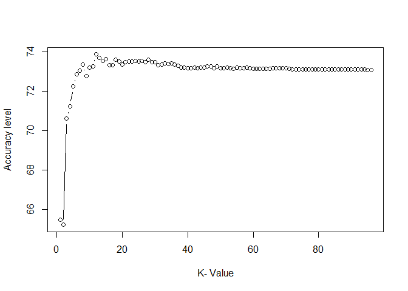

```r
#Import relevant packages
library(stats)
library(psych) 
```


```r
#loading dataset
setwd('E:/Documents/Reinp/GitHub Respositories/Loan_Prediction-with-RStudio')
ds_asses<-read.table('Data Science assessment.csv', header=TRUE,sep=",")
#ds_asses[,-14]  #Reads only the required columns in csv
View(ds_asses)
attach(ds_asses)
```


```r
#summary statistics
names(ds_asses) #display variable names
```

```
##  [1] "Product"        "CustomerGender" "Location"       "Region"        
##  [5] "TotalPrice"     "StartDate"      "Deposit"        "DailyRate"     
##  [9] "TotalDays"      "AmountPaid30"   "AmountPaid60"   "AmountPaid360" 
## [13] "LoanStatus360"
```

```r
summary(ds_asses) #summarizes the dataset
```

```
##       Product          CustomerGender        Location         Region    
##  Product A:3141   Female      :3290   Location 25: 295   Region 6:2934  
##  Product B:3862   Male        :5358   Location 3 : 244   Region 3:1941  
##  Product C: 999   NotSpecified: 547   Location 6 : 201   Region 2:1364  
##  Product D: 975                       Location 22: 179   Region 1:1232  
##  Product E: 213                       Location 39: 177   Region 7: 622  
##  Product F:   5                       Location 61: 173   Region 4: 588  
##                                       (Other)    :7926   (Other) : 514  
##    TotalPrice         StartDate       Deposit       DailyRate     
##  Min.   :13775   5/24/2014 :  28   Min.   :1000   Min.   : 35.00  
##  1st Qu.:16600   1/23/2016 :  22   1st Qu.:2000   1st Qu.: 40.00  
##  Median :16600   09-11-15  :  20   Median :2000   Median : 40.00  
##  Mean   :19266   12/13/2015:  20   Mean   :2312   Mean   : 46.45  
##  3rd Qu.:20250   9/13/2015 :  20   3rd Qu.:2000   3rd Qu.: 50.00  
##  Max.   :69225   4/23/2015 :  19   Max.   :9000   Max.   :165.00  
##                  (Other)   :9066                                  
##    TotalDays    AmountPaid30    AmountPaid60   AmountPaid360  
##  Min.   :365   Min.   :-3200   Min.   :-3200   Min.   :-3200  
##  1st Qu.:365   1st Qu.: 2500   1st Qu.: 3438   1st Qu.:11351  
##  Median :365   Median : 3351   Median : 4400   Median :15140  
##  Mean   :365   Mean   : 3580   Mean   : 4736   Mean   :14674  
##  3rd Qu.:365   3rd Qu.: 4601   3rd Qu.: 5668   3rd Qu.:16600  
##  Max.   :365   Max.   :26001   Max.   :33501   Max.   :69225  
##                                                               
##           LoanStatus360 
##  Active          :6742  
##  Blocked         : 849  
##  Finished Payment:1604  
##                         
##                         
##                         
## 
```

```r
describe(ds_asses) 
```

```
##                 vars    n     mean      sd median  trimmed     mad   min
## Product*           1 9195     2.05    1.04      2     1.91    1.48     1
## CustomerGender*    2 9195     1.70    0.57      2     1.68    0.00     1
## Location*          3 9195   339.95  248.10    305   325.95  302.45     1
## Region*            4 9195    11.58    4.68     12    12.37    4.45     1
## TotalPrice         5 9195 19266.26 6053.29  16600 18397.93 1482.60 13775
## StartDate*         6 9195   762.22  434.80    769   762.95  542.63     1
## Deposit            7 9195  2311.53 1412.61   2000  2116.56    0.00  1000
## DailyRate          8 9195    46.45   13.38     40    44.61    0.00    35
## TotalDays          9 9195   365.00    0.00    365   365.00    0.00   365
## AmountPaid30      10 9195  3580.48 2487.32   3351  3465.23 1555.25 -3200
## AmountPaid60      11 9195  4735.67 2756.33   4400  4548.92 1482.60 -3200
## AmountPaid360     12 9195 14673.83 6676.24  15140 14459.55 4062.32 -3200
## LoanStatus360*    13 9195     1.44    0.77      1     1.30    0.00     1
##                   max range  skew kurtosis    se
## Product*            6     5  0.98     0.30  0.01
## CustomerGender*     3     2  0.12    -0.58  0.01
## Location*         791   790  0.40    -1.09  2.59
## Region*            18    17 -1.44     0.84  0.05
## TotalPrice      69225 55450  4.88    26.51 63.13
## StartDate*       1517  1516 -0.03    -1.19  4.53
## Deposit          9000  8000  2.63     9.39 14.73
## DailyRate         165   130  5.02    27.94  0.14
## TotalDays         365     0   NaN      NaN  0.00
## AmountPaid30    26001 29201  1.39     6.37 25.94
## AmountPaid60    33501 36701  1.83     8.08 28.74
## AmountPaid360   69225 72425  2.18    11.88 69.62
## LoanStatus360*      3     2  1.34     0.01  0.01
```


```r
#learn more about the dataset
help(ds_asses)
```

```
## No documentation for 'ds_asses' in specified packages and libraries:
## you could try '??ds_asses'
```

```r
??ds_asses
```

```
## starting httpd help server ... done
```

```r
str(ds_asses)
```

```
## 'data.frame':	9195 obs. of  13 variables:
##  $ Product       : Factor w/ 6 levels "Product A","Product B",..: 2 2 3 2 4 2 1 2 1 1 ...
##  $ CustomerGender: Factor w/ 3 levels "Female","Male",..: 2 2 1 2 1 1 2 2 1 1 ...
##  $ Location      : Factor w/ 791 levels "Location 1","Location 10",..: 109 220 442 553 660 2 13 24 220 35 ...
##  $ Region        : Factor w/ 18 levels "Region 1","Region 10",..: 11 12 14 1 11 11 12 15 12 15 ...
##  $ TotalPrice    : int  16600 16600 15600 16600 20250 16600 20250 16600 22250 20250 ...
##  $ StartDate     : Factor w/ 1517 levels "01-01-13","01-01-15",..: 324 6 793 921 637 1065 326 1086 424 1347 ...
##  $ Deposit       : int  2000 2000 1000 2000 2000 2000 2000 2000 4000 2000 ...
##  $ DailyRate     : int  40 40 40 40 50 40 50 40 50 50 ...
##  $ TotalDays     : int  365 365 365 365 365 365 365 365 365 365 ...
##  $ AmountPaid30  : int  3121 3061 2160 3041 3470 3201 1851 3971 5750 1951 ...
##  $ AmountPaid60  : int  4241 4171 3280 4241 4820 4141 3251 4131 7450 3251 ...
##  $ AmountPaid360 : int  13621 15041 15340 15321 13720 14141 17701 15351 20250 17351 ...
##  $ LoanStatus360 : Factor w/ 3 levels "Active","Blocked",..: 1 1 1 1 1 1 1 1 1 1 ...
```

```r
class(ds_asses)
```

```
## [1] "data.frame"
```

```r
typeof(ds_asses) 
```

```
## [1] "list"
```

```r
length(ds_asses) 
```

```
## [1] 13
```

```r
#attributes(ds_asses) #columnnames(ds_asses), class(ds_asses), row.names(ds_asses)
```

```r
#distribution of input variables
table(ds_asses$LoanStatus360)
```

```
## 
##           Active          Blocked Finished Payment 
##             6742              849             1604
```

```r
table(ds_asses$CustomerGender)
```

```
## 
##       Female         Male NotSpecified 
##         3290         5358          547
```

```r
table(ds_asses$Product)
```

```
## 
## Product A Product B Product C Product D Product E Product F 
##      3141      3862       999       975       213         5
```

```r
table(ds_asses$Region)
```

```
## 
##  Region 1 Region 10 Region 11 Region 12 Region 13 Region 14 Region 15 
##      1232        38        12        39        62        25        22 
## Region 16 Region 17 Region 18  Region 2  Region 3  Region 4  Region 5 
##        11        14        16      1364      1941       588       198 
##  Region 6  Region 7  Region 8  Region 9 
##      2934       622        44        33
```

```r
table(ds_asses$DailyRate)
```

```
## 
##   35   40   50  125  165 
##   62 4825 4090  213    5
```

```r
table(ds_asses$TotalPrice)
```

```
## 
## 13775 15600 16600 19250 20250 20750 22250 53625 54625 69225 
##    62   937  3888  1008  1289   159  1634     2   211     5
```

```r
table(ds_asses$Deposit)
```

```
## 
## 1000 2000 2500 4000 8000 9000 
## 2007 5177  159 1634    2  216
```


```r
#unique values per column
unique(ds_asses$ DailyRate)
```

```
## [1]  40  50 125 165  35
```

```r
unique(ds_asses$ TotalPrice)
```

```
##  [1] 16600 15600 20250 22250 20750 54625 19250 69225 13775 53625
```

```r
unique(ds_asses$ Deposit)
```

```
## [1] 2000 1000 4000 2500 9000 8000
```

```r
unique(ds_asses$ TotalDays)
```

```
## [1] 365
```


```r
# Distribution of LoanStatus360 accross input variables 
tabLoanStatus360gender <- xtabs(~LoanStatus360+CustomerGender,data= ds_asses)
tabLoanStatus360gender
```

```
##                   CustomerGender
## LoanStatus360      Female Male NotSpecified
##   Active             2534 3891          317
##   Blocked             266  529           54
##   Finished Payment    490  938          176
```

```r
tabLoanStatus360product <- xtabs(~LoanStatus360+Product,data= ds_asses)
tabLoanStatus360product
```

```
##                   Product
## LoanStatus360      Product A Product B Product C Product D Product E
##   Active                2550      2784       591       625       189
##   Blocked                253       435        81        73         6
##   Finished Payment       338       643       327       277        18
##                   Product
## LoanStatus360      Product F
##   Active                   3
##   Blocked                  1
##   Finished Payment         1
```

```r
tabLoanStatus360region <- xtabs(~LoanStatus360+Region,data= ds_asses)
tabLoanStatus360region
```

```
##                   Region
## LoanStatus360      Region 1 Region 10 Region 11 Region 12 Region 13
##   Active                857        29         8        25        55
##   Blocked               155         4         0         4         0
##   Finished Payment      220         5         4        10         7
##                   Region
## LoanStatus360      Region 14 Region 15 Region 16 Region 17 Region 18
##   Active                  20        10         8         8        10
##   Blocked                  2         3         1         2         2
##   Finished Payment         3         9         2         4         4
##                   Region
## LoanStatus360      Region 2 Region 3 Region 4 Region 5 Region 6 Region 7
##   Active               1004     1496      422      126     2133      494
##   Blocked               142      142       54       10      262       54
##   Finished Payment      218      303      112       62      539       74
##                   Region
## LoanStatus360      Region 8 Region 9
##   Active                 21       16
##   Blocked                 9        3
##   Finished Payment       14       14
```

```r
tabLoanStatus360deposit <- xtabs(~LoanStatus360+Deposit,data= ds_asses)
tabLoanStatus360deposit
```

```
##                   Deposit
## LoanStatus360      1000 2000 2500 4000 8000 9000
##   Active           1473 3696  140 1241    2  190
##   Blocked           175  550   11  106    0    7
##   Finished Payment  359  931    8  287    0   19
```

```r
tabLoanStatus360dailyrate <- xtabs(~LoanStatus360+DailyRate,data= ds_asses)
tabLoanStatus360dailyrate
```

```
##                   DailyRate
## LoanStatus360        35   40   50  125  165
##   Active             55 3339 3156  189    3
##   Blocked             0  520  322    6    1
##   Finished Payment    7  966  612   18    1
```

```r
tabLoanStatus360totalprice <- xtabs(~LoanStatus360+TotalPrice,data= ds_asses)
tabLoanStatus360totalprice
```

```
##                   TotalPrice
## LoanStatus360      13775 15600 16600 19250 20250 20750 22250 53625 54625
##   Active              55   536  2803   882   893   140  1241     2   187
##   Blocked              0    81   439    94   111    11   106     0     6
##   Finished Payment     7   320   646    32   285     8   287     0    18
##                   TotalPrice
## LoanStatus360      69225
##   Active               3
##   Blocked              1
##   Finished Payment     1
```


```r
#convert categorical variables to integer data types for regression purpose
ds_asses [,1]=as.integer(ds_asses [,1])
is.factor(ds_asses [,1])
```

```
## [1] FALSE
```

```r
is.integer(ds_asses [,1])
```

```
## [1] TRUE
```

```r
is.character(ds_asses [,1])
```

```
## [1] FALSE
```

```r
ds_asses [,2]=as.integer(ds_asses [,2])-1
is.factor(ds_asses [,2])
```

```
## [1] FALSE
```

```r
is.integer(ds_asses [,2])
```

```
## [1] FALSE
```

```r
is.character(ds_asses [,2])
```

```
## [1] FALSE
```

```r
ds_asses [,3]=as.integer(ds_asses [,3])
is.factor(ds_asses [,3])
```

```
## [1] FALSE
```

```r
is.integer(ds_asses [,3])
```

```
## [1] TRUE
```

```r
is.character(ds_asses [,3])
```

```
## [1] FALSE
```

```r
ds_asses [,4]=as.integer(ds_asses [,4])
is.factor(ds_asses [,4])
```

```
## [1] FALSE
```

```r
is.integer(ds_asses [,4])
```

```
## [1] TRUE
```

```r
is.character(ds_asses [,4])
```

```
## [1] FALSE
```

```r
ds_asses [,13]=as.integer(ds_asses [,13])-1
is.factor(ds_asses [,13])
```

```
## [1] FALSE
```

```r
is.integer(ds_asses [,13])
```

```
## [1] FALSE
```

```r
is.character(ds_asses [,13])
```

```
## [1] FALSE
```

```r
View(ds_asses)
```


```r
cor_ds_asses1 <- cor(ds_asses [, c("Product", "CustomerGender", "Location", 
"Region" ,"TotalPrice", "Deposit", "DailyRate", "TotalDays", "AmountPaid30", 
"AmountPaid60", "AmountPaid360", "LoanStatus360")])
```

```
## Warning in cor(ds_asses[, c("Product", "CustomerGender", "Location",
## "Region", : the standard deviation is zero
```

```r
cor_ds_asses1
```

```
##                    Product CustomerGender     Location       Region
## Product         1.00000000    0.215410318 -0.078985609 -0.078691471
## CustomerGender  0.21541032    1.000000000 -0.025930697 -0.001637478
## Location       -0.07898561   -0.025930697  1.000000000  0.068602167
## Region         -0.07869147   -0.001637478  0.068602167  1.000000000
## TotalPrice      0.27738511   -0.061481106  0.022741907  0.020786524
## Deposit         0.08285576   -0.112198881  0.043638353  0.042175248
## DailyRate       0.31995111   -0.043765449  0.015570866  0.013569760
## TotalDays               NA             NA           NA           NA
## AmountPaid30    0.30512783   -0.019341926  0.016622021  0.037297000
## AmountPaid60    0.31947942   -0.019891374  0.019311098  0.044764604
## AmountPaid360   0.30005376   -0.001685120  0.020024004  0.050803703
## LoanStatus360   0.13397102    0.091076265 -0.002814233 -0.012374521
##                 TotalPrice     Deposit   DailyRate TotalDays AmountPaid30
## Product         0.27738511  0.08285576  0.31995111        NA   0.30512783
## CustomerGender -0.06148111 -0.11219888 -0.04376545        NA  -0.01934193
## Location        0.02274191  0.04363835  0.01557087        NA   0.01662202
## Region          0.02078652  0.04217525  0.01356976        NA   0.03729700
## TotalPrice      1.00000000  0.86554131  0.98944434        NA   0.63233502
## Deposit         0.86554131  1.00000000  0.78382689        NA   0.80411920
## DailyRate       0.98944434  0.78382689  1.00000000        NA   0.55135520
## TotalDays               NA          NA          NA         1           NA
## AmountPaid30    0.63233502  0.80411920  0.55135520        NA   1.00000000
## AmountPaid60    0.68124418  0.81250190  0.60957131        NA   0.96219284
## AmountPaid360   0.69030820  0.66266283  0.66416437        NA   0.67589134
## LoanStatus360  -0.06902098 -0.04673281 -0.07205609        NA   0.14305659
##                AmountPaid60 AmountPaid360 LoanStatus360
## Product          0.31947942    0.30005376   0.133971022
## CustomerGender  -0.01989137   -0.00168512   0.091076265
## Location         0.01931110    0.02002400  -0.002814233
## Region           0.04476460    0.05080370  -0.012374521
## TotalPrice       0.68124418    0.69030820  -0.069020979
## Deposit          0.81250190    0.66266283  -0.046732808
## DailyRate        0.60957131    0.66416437  -0.072056093
## TotalDays                NA            NA            NA
## AmountPaid30     0.96219284    0.67589134   0.143056589
## AmountPaid60     1.00000000    0.75124389   0.145567908
## AmountPaid360    0.75124389    1.00000000   0.109930606
## LoanStatus360    0.14556791    0.10993061   1.000000000
```

```r
#Drop TotalDays column as it is not correlated with the rest of the columns
cor_ds_asses <- round(cor(ds_asses [, c("Product", "CustomerGender", "Location", 
"Region" ,"TotalPrice", "Deposit", "DailyRate", "AmountPaid30", "AmountPaid60", 
"AmountPaid360", "LoanStatus360")]),2)
cor_ds_asses
```

```
##                Product CustomerGender Location Region TotalPrice Deposit
## Product           1.00           0.22    -0.08  -0.08       0.28    0.08
## CustomerGender    0.22           1.00    -0.03   0.00      -0.06   -0.11
## Location         -0.08          -0.03     1.00   0.07       0.02    0.04
## Region           -0.08           0.00     0.07   1.00       0.02    0.04
## TotalPrice        0.28          -0.06     0.02   0.02       1.00    0.87
## Deposit           0.08          -0.11     0.04   0.04       0.87    1.00
## DailyRate         0.32          -0.04     0.02   0.01       0.99    0.78
## AmountPaid30      0.31          -0.02     0.02   0.04       0.63    0.80
## AmountPaid60      0.32          -0.02     0.02   0.04       0.68    0.81
## AmountPaid360     0.30           0.00     0.02   0.05       0.69    0.66
## LoanStatus360     0.13           0.09     0.00  -0.01      -0.07   -0.05
##                DailyRate AmountPaid30 AmountPaid60 AmountPaid360
## Product             0.32         0.31         0.32          0.30
## CustomerGender     -0.04        -0.02        -0.02          0.00
## Location            0.02         0.02         0.02          0.02
## Region              0.01         0.04         0.04          0.05
## TotalPrice          0.99         0.63         0.68          0.69
## Deposit             0.78         0.80         0.81          0.66
## DailyRate           1.00         0.55         0.61          0.66
## AmountPaid30        0.55         1.00         0.96          0.68
## AmountPaid60        0.61         0.96         1.00          0.75
## AmountPaid360       0.66         0.68         0.75          1.00
## LoanStatus360      -0.07         0.14         0.15          0.11
##                LoanStatus360
## Product                 0.13
## CustomerGender          0.09
## Location                0.00
## Region                 -0.01
## TotalPrice             -0.07
## Deposit                -0.05
## DailyRate              -0.07
## AmountPaid30            0.14
## AmountPaid60            0.15
## AmountPaid360           0.11
## LoanStatus360           1.00
```


```r
# we create a heatmap to visualize correlations

cor.plot((ds_asses [, c("Product", "CustomerGender", "Location", "Region" ,
"TotalPrice", "Deposit", "DailyRate", "AmountPaid30", "AmountPaid60",
"AmountPaid360", "LoanStatus360")]),numbers=TRUE,main="corlpot")
```

<!-- -->

```r
#or

# Get lower triangle of the correlation matrix
  get_lower_tri <- function(cor_ds_asses){
    cor_ds_asses[upper.tri(cor_ds_asses)]<- NA
    return(cor_ds_asses)
  }
lower_tri <- get_lower_tri(cor_ds_asses)
lower_tri
```

```
##                Product CustomerGender Location Region TotalPrice Deposit
## Product           1.00             NA       NA     NA         NA      NA
## CustomerGender    0.22           1.00       NA     NA         NA      NA
## Location         -0.08          -0.03     1.00     NA         NA      NA
## Region           -0.08           0.00     0.07   1.00         NA      NA
## TotalPrice        0.28          -0.06     0.02   0.02       1.00      NA
## Deposit           0.08          -0.11     0.04   0.04       0.87    1.00
## DailyRate         0.32          -0.04     0.02   0.01       0.99    0.78
## AmountPaid30      0.31          -0.02     0.02   0.04       0.63    0.80
## AmountPaid60      0.32          -0.02     0.02   0.04       0.68    0.81
## AmountPaid360     0.30           0.00     0.02   0.05       0.69    0.66
## LoanStatus360     0.13           0.09     0.00  -0.01      -0.07   -0.05
##                DailyRate AmountPaid30 AmountPaid60 AmountPaid360
## Product               NA           NA           NA            NA
## CustomerGender        NA           NA           NA            NA
## Location              NA           NA           NA            NA
## Region                NA           NA           NA            NA
## TotalPrice            NA           NA           NA            NA
## Deposit               NA           NA           NA            NA
## DailyRate           1.00           NA           NA            NA
## AmountPaid30        0.55         1.00           NA            NA
## AmountPaid60        0.61         0.96         1.00            NA
## AmountPaid360       0.66         0.68         0.75          1.00
## LoanStatus360      -0.07         0.14         0.15          0.11
##                LoanStatus360
## Product                   NA
## CustomerGender            NA
## Location                  NA
## Region                    NA
## TotalPrice                NA
## Deposit                   NA
## DailyRate                 NA
## AmountPaid30              NA
## AmountPaid60              NA
## AmountPaid360             NA
## LoanStatus360              1
```

```r
# Get upper triangle of the correlation matrix
  get_upper_tri <- function(cor_ds_asses){
    cor_ds_asses[lower.tri(cor_ds_asses)]<- NA
    return(cor_ds_asses)
  }
upper_tri <- get_upper_tri(cor_ds_asses)
upper_tri
```

```
##                Product CustomerGender Location Region TotalPrice Deposit
## Product              1           0.22    -0.08  -0.08       0.28    0.08
## CustomerGender      NA           1.00    -0.03   0.00      -0.06   -0.11
## Location            NA             NA     1.00   0.07       0.02    0.04
## Region              NA             NA       NA   1.00       0.02    0.04
## TotalPrice          NA             NA       NA     NA       1.00    0.87
## Deposit             NA             NA       NA     NA         NA    1.00
## DailyRate           NA             NA       NA     NA         NA      NA
## AmountPaid30        NA             NA       NA     NA         NA      NA
## AmountPaid60        NA             NA       NA     NA         NA      NA
## AmountPaid360       NA             NA       NA     NA         NA      NA
## LoanStatus360       NA             NA       NA     NA         NA      NA
##                DailyRate AmountPaid30 AmountPaid60 AmountPaid360
## Product             0.32         0.31         0.32          0.30
## CustomerGender     -0.04        -0.02        -0.02          0.00
## Location            0.02         0.02         0.02          0.02
## Region              0.01         0.04         0.04          0.05
## TotalPrice          0.99         0.63         0.68          0.69
## Deposit             0.78         0.80         0.81          0.66
## DailyRate           1.00         0.55         0.61          0.66
## AmountPaid30          NA         1.00         0.96          0.68
## AmountPaid60          NA           NA         1.00          0.75
## AmountPaid360         NA           NA           NA          1.00
## LoanStatus360         NA           NA           NA            NA
##                LoanStatus360
## Product                 0.13
## CustomerGender          0.09
## Location                0.00
## Region                 -0.01
## TotalPrice             -0.07
## Deposit                -0.05
## DailyRate              -0.07
## AmountPaid30            0.14
## AmountPaid60            0.15
## AmountPaid360           0.11
## LoanStatus360           1.00
```

```r
# Reorder the correlation matrix
reorder_cor_ds_asses <- function(cor_ds_asses){
# Use correlation between variables as distance
dd <- as.dist((1-cor_ds_asses)/2)
hc <- hclust(dd)
cor_ds_asses <-cor_ds_asses[hc$order, hc$order]
}
cor_ds_asses <- reorder_cor_ds_asses(cor_ds_asses)
# Melt the correlation matrix
library(reshape2)

melted_cor_ds_asses <- melt(upper_tri, na.rm = TRUE)

library(ggplot2)
```

```
## Warning: package 'ggplot2' was built under R version 3.6.1
```

```
## 
## Attaching package: 'ggplot2'
```

```
## The following objects are masked from 'package:psych':
## 
##     %+%, alpha
```

```r
ggplot(data = melted_cor_ds_asses, aes(Var2, Var1, fill = value))+
 geom_tile(color = "white")+ 
 scale_fill_gradient2(low = "blue", high = "red", mid = "green", 
   midpoint = 0, limit = c(-1,1), space = "Lab", 
   name="Pearson\nCorrelation") +
  theme_minimal()+ 
 theme(axis.text.x = element_text(angle = 45, vjust = 1, 
    size = 12, hjust = 1))+
 coord_fixed()
```

<!-- -->


```r
#additive model investigates only the main effects of predictors. 
#It assumes that the relationship between a given predictor variable 
#and the outcome is independent of the other predictor variables

#From the correlation table, we see that the AmountPaid360 is most 
#strongly correlated with AmountPaid60. But in addition, we also see that 
#TotalPrice and Deposit are positively correlated. 

#We want to compute the association of the outcome variable AmountPaid360 
#with each predictor while adjusting for the effect of the remaining predictors. 

#Both the multivariate regression and the correlation measure how strongly 
#the features are associated with the outcome (AmountPaid360). When comparing 
#the regression coefficients with the correlation coefficients, we will see 
#that they are slightly different.Ccorrelation computes bivariate relationship 
#between the outcome variable and a single predictor (ignoring all other 
#predictors) while a multiple regression asks if that predictor is related 
#to the outcome after controlling for all the other predictors in the model.

mlm1a <- lm(AmountPaid360 ~ Product + CustomerGender + Location + Region 
+ TotalPrice + Deposit + DailyRate + AmountPaid30 + AmountPaid60, 
data=ds_asses) #multivariate regression
summary(mlm1a)
```

```
## 
## Call:
## lm(formula = AmountPaid360 ~ Product + CustomerGender + Location + 
##     Region + TotalPrice + Deposit + DailyRate + AmountPaid30 + 
##     AmountPaid60, data = ds_asses)
## 
## Residuals:
##    Min     1Q Median     3Q    Max 
## -25651  -2483   1013   2934  14683 
## 
## Coefficients: (1 not defined because of singularities)
##                  Estimate Std. Error t value Pr(>|t|)    
## (Intercept)    -694.34338  209.96174  -3.307 0.000947 ***
## Product         -98.95731   53.05113  -1.865 0.062168 .  
## CustomerGender  174.88070   74.04345   2.362 0.018204 *  
## Location          0.13513    0.16641   0.812 0.416790    
## Region           27.16438    8.84915   3.070 0.002149 ** 
## TotalPrice        0.51187    0.01701  30.093  < 2e-16 ***
## Deposit          -1.18053    0.09674 -12.203  < 2e-16 ***
## DailyRate              NA         NA      NA       NA    
## AmountPaid30     -1.10490    0.06665 -16.577  < 2e-16 ***
## AmountPaid60      2.51516    0.05841  43.064  < 2e-16 ***
## ---
## Signif. codes:  0 '***' 0.001 '**' 0.01 '*' 0.05 '.' 0.1 ' ' 1
## 
## Residual standard error: 3934 on 9186 degrees of freedom
## Multiple R-squared:  0.6531,	Adjusted R-squared:  0.6528 
## F-statistic:  2162 on 8 and 9186 DF,  p-value: < 2.2e-16
```


```r
#DropDailyRate
mlm2a <- lm(AmountPaid360 ~ Product + CustomerGender + Location + 
Region + TotalPrice + Deposit + AmountPaid30 + AmountPaid60, 
data=ds_asses) #multivariate regression
summary(mlm2a)
```

```
## 
## Call:
## lm(formula = AmountPaid360 ~ Product + CustomerGender + Location + 
##     Region + TotalPrice + Deposit + AmountPaid30 + AmountPaid60, 
##     data = ds_asses)
## 
## Residuals:
##    Min     1Q Median     3Q    Max 
## -25651  -2483   1013   2934  14683 
## 
## Coefficients:
##                  Estimate Std. Error t value Pr(>|t|)    
## (Intercept)    -694.34338  209.96174  -3.307 0.000947 ***
## Product         -98.95731   53.05113  -1.865 0.062168 .  
## CustomerGender  174.88070   74.04345   2.362 0.018204 *  
## Location          0.13513    0.16641   0.812 0.416790    
## Region           27.16438    8.84915   3.070 0.002149 ** 
## TotalPrice        0.51187    0.01701  30.093  < 2e-16 ***
## Deposit          -1.18053    0.09674 -12.203  < 2e-16 ***
## AmountPaid30     -1.10490    0.06665 -16.577  < 2e-16 ***
## AmountPaid60      2.51516    0.05841  43.064  < 2e-16 ***
## ---
## Signif. codes:  0 '***' 0.001 '**' 0.01 '*' 0.05 '.' 0.1 ' ' 1
## 
## Residual standard error: 3934 on 9186 degrees of freedom
## Multiple R-squared:  0.6531,	Adjusted R-squared:  0.6528 
## F-statistic:  2162 on 8 and 9186 DF,  p-value: < 2.2e-16
```

```r
#Observed value in data is 13621
newdata <- data.frame(Product =2,  CustomerGender=1, Location=109, 
Region=11, TotalPrice=16600, Deposit=2000, AmountPaid30=3121, 
AmountPaid60=4241)
p <- predict(mlm2a, newdata, interval="confidence")
p
```

```
##        fit   lwr      upr
## 1 12950.48 12822 13078.97
```


```r
#Drop Location does not contribute to the model
mlm3a <- lm(AmountPaid360 ~ Product + CustomerGender + Region + 
TotalPrice + Deposit + AmountPaid30 + AmountPaid60, data=ds_asses) 
#multivariate regression
summary(mlm3a)
```

```
## 
## Call:
## lm(formula = AmountPaid360 ~ Product + CustomerGender + Region + 
##     TotalPrice + Deposit + AmountPaid30 + AmountPaid60, data = ds_asses)
## 
## Residuals:
##    Min     1Q Median     3Q    Max 
## -25631  -2490   1004   2931  14661 
## 
## Coefficients:
##                  Estimate Std. Error t value Pr(>|t|)    
## (Intercept)    -651.26315  203.14502  -3.206  0.00135 ** 
## Product        -101.57837   52.95186  -1.918  0.05510 .  
## CustomerGender  174.65458   74.04156   2.359  0.01835 *  
## Region           27.59426    8.83313   3.124  0.00179 ** 
## TotalPrice        0.51190    0.01701  30.096  < 2e-16 ***
## Deposit          -1.17973    0.09673 -12.196  < 2e-16 ***
## AmountPaid30     -1.10534    0.06665 -16.584  < 2e-16 ***
## AmountPaid60      2.51566    0.05840  43.076  < 2e-16 ***
## ---
## Signif. codes:  0 '***' 0.001 '**' 0.01 '*' 0.05 '.' 0.1 ' ' 1
## 
## Residual standard error: 3934 on 9187 degrees of freedom
## Multiple R-squared:  0.6531,	Adjusted R-squared:  0.6528 
## F-statistic:  2471 on 7 and 9187 DF,  p-value: < 2.2e-16
```

```r
#Observed value in data is 13621
newdata1 <- data.frame(Product=2, CustomerGender=1, Region=11, 
TotalPrice=16600, Deposit=2000, AmountPaid30=3121, AmountPaid60=4241)
p1 <- predict(mlm3a, newdata1, interval="confidence")
p1
```

```
##        fit      lwr      upr
## 1 12981.11 12876.02 13086.19
```

```r
#Drop Product does not contribute to the model
#Final Model
mlm4a <- lm(AmountPaid360 ~ CustomerGender + Region + TotalPrice + 
Deposit + AmountPaid30 + AmountPaid60, data=ds_asses) 
#multivariate regression
summary(mlm4a)
```

```
## 
## Call:
## lm(formula = AmountPaid360 ~ CustomerGender + Region + TotalPrice + 
##     Deposit + AmountPaid30 + AmountPaid60, data = ds_asses)
## 
## Residuals:
##    Min     1Q Median     3Q    Max 
## -25651  -2488   1009   2920  14711 
## 
## Coefficients:
##                  Estimate Std. Error t value Pr(>|t|)    
## (Intercept)    -643.70881  203.13647  -3.169 0.001535 ** 
## CustomerGender  150.33778   72.95903   2.061 0.039371 *  
## Region           29.20511    8.79441   3.321 0.000901 ***
## TotalPrice        0.49460    0.01442  34.292  < 2e-16 ***
## Deposit          -1.07204    0.07879 -13.607  < 2e-16 ***
## AmountPaid30     -1.13537    0.06480 -17.522  < 2e-16 ***
## AmountPaid60      2.51027    0.05834  43.027  < 2e-16 ***
## ---
## Signif. codes:  0 '***' 0.001 '**' 0.01 '*' 0.05 '.' 0.1 ' ' 1
## 
## Residual standard error: 3934 on 9188 degrees of freedom
## Multiple R-squared:  0.653,	Adjusted R-squared:  0.6527 
## F-statistic:  2881 on 6 and 9188 DF,  p-value: < 2.2e-16
```

```r
#Observed value in data is 13621
newdata2 <- data.frame(CustomerGender=1, Region=11, TotalPrice=16600, 
Deposit=2000, AmountPaid30=3121, AmountPaid60=4241)
p2 <- predict(mlm4a, newdata2, interval="confidence")
p2
```

```
##       fit      lwr      upr
## 1 12996.8 12892.93 13100.67
```

```r
sigma(mlm4a) # Residual Standard Error (RSE). The lower the RSE, the more 
```

```
## [1] 3934.305
```

```r
#accurate the model (on the data in hand).
sigma(mlm4a)/mean(ds_asses$AmountPaid360) #The error rate
```

```
## [1] 0.2681171
```

```r
coefficients(mlm4a) # model coefficients
```

```
##    (Intercept) CustomerGender         Region     TotalPrice        Deposit 
##   -643.7088144    150.3377772     29.2051094      0.4946036     -1.0720393 
##   AmountPaid30   AmountPaid60 
##     -1.1353656      2.5102698
```

```r
confint(mlm4a, level=0.95) # CIs for model parameters
```

```
##                        2.5 %       97.5 %
## (Intercept)    -1041.9014283 -245.5162006
## CustomerGender     7.3218671  293.3536872
## Region            11.9661084   46.4441103
## TotalPrice         0.4663306    0.5228766
## Deposit           -1.2264811   -0.9175974
## AmountPaid30      -1.2623783   -1.0083530
## AmountPaid60       2.3959069    2.6246327
```

```r
anova(mlm4a) # anova table
```

```
## Analysis of Variance Table
## 
## Response: AmountPaid360
##                  Df     Sum Sq    Mean Sq    F value Pr(>F)    
## CustomerGender    1 1.1637e+06 1.1637e+06     0.0752 0.7839    
## Region            1 1.0576e+09 1.0576e+09    68.3246 <2e-16 ***
## TotalPrice        1 1.9545e+11 1.9545e+11 12626.8814 <2e-16 ***
## Deposit           1 7.3892e+09 7.3892e+09   477.3748 <2e-16 ***
## AmountPaid30      1 3.5026e+10 3.5026e+10  2262.8199 <2e-16 ***
## AmountPaid60      1 2.8656e+10 2.8656e+10  1851.3177 <2e-16 ***
## Residuals      9188 1.4222e+11 1.5479e+07                      
## ---
## Signif. codes:  0 '***' 0.001 '**' 0.01 '*' 0.05 '.' 0.1 ' ' 1
```

```r
vcov(mlm4a) # covariance matrix for model parameters
```

```
##                  (Intercept) CustomerGender        Region    TotalPrice
## (Intercept)     4.126442e+04  -3.073529e+03 -9.077594e+02 -2.0624482419
## CustomerGender -3.073529e+03   5.323020e+03 -3.338803e+00 -0.0993581245
## Region         -9.077594e+02  -3.338803e+00  7.734168e+01  0.0050764365
## TotalPrice     -2.062448e+00  -9.935812e-02  5.076437e-03  0.0002080335
## Deposit         7.082079e+00   1.030079e+00 -2.701815e-02 -0.0008656772
## AmountPaid30   -9.628892e-01  -2.487421e-01  1.979133e-02  0.0003067156
## AmountPaid60   -2.050758e-02  -4.203525e-02 -1.941552e-02 -0.0002178811
##                      Deposit  AmountPaid30  AmountPaid60
## (Intercept)     7.0820792766 -0.9628892221 -0.0205075822
## CustomerGender  1.0300788573 -0.2487420904 -0.0420352501
## Region         -0.0270181465  0.0197913250 -0.0194155166
## TotalPrice     -0.0008656772  0.0003067156 -0.0002178811
## Deposit         0.0062075375 -0.0017222672  0.0002120275
## AmountPaid30   -0.0017222672  0.0041983941 -0.0033896522
## AmountPaid60    0.0002120275 -0.0033896522  0.0034037673
```


```r
#fitted(mlm4a) # predicted values
```


```r
#residuals(mlm4a) # residuals
```


```r
#influence(mlm4a) # regression diagnostics $hat $coefficients $sigma 
#$wt. residuals
```


```r
#Understanding Accuracy of the final model with Actual vs Predicted
plot(fitted(mlm4a), ds_asses$AmountPaid360, 
     ylab="Actual", xlab="Predicted", 
     main="AmountPaid360")
```

<!-- -->

```r
#Accuracy of the final model with Residual vs Predicted
#positive values for the residual (on the y-axis) mean the prediction 
#was too low, and negative values mean the prediction was too high; 
#0 means the guess was exactly correct.
plot(fitted(mlm4a), residuals(mlm4a), 
     ylab="Residuals", xlab="Predicted", 
     main="AmountPaid360")
abline(0,0)
```

<!-- -->


```r
#The final multiple regression model equation can be written as AmountPaid360 =
#-643.7088144 + 150.3377772*CustomerGender + 29.2051094*Region + 
#0.4946036*TotalPrice - 1.0720393*Deposit - 1.1353656*AmountPaid30 + 
#2.5102698*AmountPaid60.


#The overall quality of the model can be assessed by examining the R-squared (R2) 
#and Residual Standard Error (RSE).

#R2 represents the correlation coefficient between the observed values of the 
#outcome variable (y) and the predicted values of y. For this reason, the value of 
#R will always be positive and will range from zero to one. R2 represents the 
#proportion of variance, in the outcome variable y, that may be predicted by 
#knowing the value of the x variables. An R2 value close to 1 indicates that the 
#model explains a large portion of the variance in the outcome variable. Problem 
#with the R2, is that, it will always increase when more variables are added to 
#the model, even if those variables are only weakly associated with the response. A 
#solution is to adjust the R2 by taking into account the number of predictor variables.

#The adjusted R2 = 0.6527, meaning that “65.27% of the variance in the measure of 
#AmountPaid360 can be predicted by CustomerGender, Region, TotalPrice, Deposit,  
#AmountPaid30 and AmountPaid60.
#In our multiple regression model, the RSE is 3934.305 corresponding to 26.8% error rate.
```


```r
#Classification model to predict LoanStatus360
ds_asses1 <- ds_asses [, c("Product", "CustomerGender", "Location", "Region" ,
"TotalPrice", "Deposit", "DailyRate", "AmountPaid30", "AmountPaid60", 
"LoanStatus360")]

# see the stucture
head(ds_asses1)
```

```
##   Product CustomerGender Location Region TotalPrice Deposit DailyRate
## 1       2              1      109     11      16600    2000        40
## 2       2              1      220     12      16600    2000        40
## 3       3              0      442     14      15600    1000        40
## 4       2              1      553      1      16600    2000        40
## 5       4              0      660     11      20250    2000        50
## 6       2              0        2     11      16600    2000        40
##   AmountPaid30 AmountPaid60 LoanStatus360
## 1         3121         4241             0
## 2         3061         4171             0
## 3         2160         3280             0
## 4         3041         4241             0
## 5         3470         4820             0
## 6         3201         4141             0
```

```r
tail(ds_asses1)
```

```
##      Product CustomerGender Location Region TotalPrice Deposit DailyRate
## 9190       3              1      447     15      15600    1000        40
## 9191       1              0      221     11      20250    2000        50
## 9192       4              0      520     15      20250    2000        50
## 9193       2              0      763     11      16600    2000        40
## 9194       2              1      331     13      16600    2000        40
## 9195       4              1       67      1      20250    2000        50
##      AmountPaid30 AmountPaid60 LoanStatus360
## 9190         2040         3400             2
## 9191         3601         4301             2
## 9192         4001         5501             2
## 9193         3401         4601             2
## 9194         3400         4600             2
## 9195         6950         6950             2
```

```r
#1.Shuffle your data
#From the head and tail output, you can see if the data is shuffled or not. 
#If not shuffled it will be a big issue! When you will split your data between 
#a train set and test set, you will select only loanstatus 0 and 1 (No 2 are in 
#the top 80 percent of the observations), which means the algorithm will never see 
#the features of 2. This mistake will lead to poor prediction.

shuffle_index <- sample(1:nrow(ds_asses1)) #Generate a random list of index from 
#1 to 9195
head(shuffle_index)
```

```
## [1] 8709 8045 7716   87 8360 6364
```

```r
tail(shuffle_index)
```

```
## [1] 5828  842 7032 6483 4425 5780
```

```r
ds_asses2 <- ds_asses1[shuffle_index, ]
head(ds_asses2)
```

```
##      Product CustomerGender Location Region TotalPrice Deposit DailyRate
## 8709       2              1       11     15      16600    2000        40
## 8045       2              0      692     13      16600    2000        40
## 7716       3              0       47     15      15600    1000        40
## 87         1              1       13     12      22250    4000        50
## 8360       3              2      400      1      15600    1000        40
## 6364       1              0      176     12      22250    4000        50
##      AmountPaid30 AmountPaid60 LoanStatus360
## 8709         3421         4621             2
## 8045         3701         4701             2
## 7716         4700         6700             2
## 87           6000         6550             0
## 8360         3500         4400             2
## 6364         5300         7200             0
```

```r
tail(ds_asses2)
```

```
##      Product CustomerGender Location Region TotalPrice Deposit DailyRate
## 5828       2              1      431     15      16600    2000        40
## 842        1              0       11     15      22250    4000        50
## 7032       1              1      243     15      22250    4000        50
## 6483       2              0      763     11      16600    2000        40
## 4425       1              1      420     15      22250    4000        50
## 5780       2              1      692     13      16600    2000        40
##      AmountPaid30 AmountPaid60 LoanStatus360
## 5828         3200         4320             0
## 842          5650         6800             0
## 7032         5030         5670             1
## 6483         3400         4310             0
## 4425         7250         8450             0
## 5780         3040         4240             0
```

```r
#2.Create a train and test set: You train the model on the train set and test the 
#prediction on the test set (i.e. unseen data)

#Split the data 80/20, 80 percent of the data serves to train the model, and 20 
#percent to make predictions

#Function to create two separate data frames. You don't want to touch the test set 
#until you finish building your model

create_train_test <- function(data, size = 0.8, train = TRUE) #Add the arguments in 
  #the function
  {
    n_row = nrow(data) #Count number of rows in the dataset
    total_row = size * n_row #Return the nth row to construct the train set
    train_sample <- 1: total_row #Select the first row to the nth rows
    if (train == TRUE) {
        return (data[train_sample, ]) #If condition sets to true, return the 
      #train set, else the test set
    } else {
        return (data[-train_sample, ])
    }
}

data_train <- create_train_test(ds_asses2, 0.8, train = TRUE)
data_test <- create_train_test(ds_asses2, 0.8, train = FALSE)
dim(data_train)
```

```
## [1] 7356   10
```

```r
dim(data_test)
```

```
## [1] 1839   10
```

```r
#Verify Randomization Process
prop.table(table(data_train$CustomerGender))
```

```
## 
##          0          1          2 
## 0.35494834 0.58564437 0.05940729
```

```r
prop.table(table(data_test$CustomerGender))
```

```
## 
##          0          1          2 
## 0.36922240 0.57096248 0.05981512
```

```r
#3.Buildthemodel

library(rpart)
fit <- rpart(LoanStatus360~., data = data_train, method = 'class')
fit
```

```
## n= 7356 
## 
## node), split, n, loss, yval, (yprob)
##       * denotes terminal node
## 
##  1) root 7356 1919 0 (0.73912452 0.08890701 0.17196846)  
##    2) AmountPaid60< 4563 4099  875 0 (0.78653330 0.12173701 0.09172969) *
##    3) AmountPaid60>=4563 3257 1044 0 (0.67945963 0.04758981 0.27295057)  
##      6) TotalPrice>=21500 1464  317 0 (0.78346995 0.05532787 0.16120219) *
##      7) TotalPrice< 21500 1793  727 0 (0.59453430 0.04127161 0.36419409)  
##       14) AmountPaid60< 5250.5 1148  359 0 (0.68728223 0.04703833 0.26567944) *
##       15) AmountPaid60>=5250.5 645  297 2 (0.42945736 0.03100775 0.53953488)  
##         30) AmountPaid60< 7000.5 405  197 0 (0.51358025 0.03456790 0.45185185) *
##         31) AmountPaid60>=7000.5 240   75 2 (0.28750000 0.02500000 0.68750000) *
```

```r
#4.Make a Prediction

predict_unseen <-predict(fit, data_test, type = 'class')
table_mat <- table(data_test$LoanStatus360, predict_unseen)
table_mat
```

```
##    predict_unseen
##        0    1    2
##   0 1283    0   22
##   1  191    0    4
##   2  304    0   35
```

```r
library(gmodels)
```

```
## Warning: package 'gmodels' was built under R version 3.6.1
```

```r
#understand the relationship of the classes of your test data related to your model 
CrossTable(x = data_test$LoanStatus360, y = predict_unseen, prop.chisq=FALSE)
```

```
## 
##  
##    Cell Contents
## |-------------------------|
## |                       N |
## |           N / Row Total |
## |           N / Col Total |
## |         N / Table Total |
## |-------------------------|
## 
##  
## Total Observations in Table:  1839 
## 
##  
##                         | predict_unseen 
## data_test$LoanStatus360 |         0 |         2 | Row Total | 
## ------------------------|-----------|-----------|-----------|
##                       0 |      1283 |        22 |      1305 | 
##                         |     0.983 |     0.017 |     0.710 | 
##                         |     0.722 |     0.361 |           | 
##                         |     0.698 |     0.012 |           | 
## ------------------------|-----------|-----------|-----------|
##                       1 |       191 |         4 |       195 | 
##                         |     0.979 |     0.021 |     0.106 | 
##                         |     0.107 |     0.066 |           | 
##                         |     0.104 |     0.002 |           | 
## ------------------------|-----------|-----------|-----------|
##                       2 |       304 |        35 |       339 | 
##                         |     0.897 |     0.103 |     0.184 | 
##                         |     0.171 |     0.574 |           | 
##                         |     0.165 |     0.019 |           | 
## ------------------------|-----------|-----------|-----------|
##            Column Total |      1778 |        61 |      1839 | 
##                         |     0.967 |     0.033 |           | 
## ------------------------|-----------|-----------|-----------|
## 
## 
```

```r
#5.MeasurePerfomance
#compute an accuracy measure for classification task with the confusion matrix. The
#general idea is to count the number of times True instances are classified as False.

accuracy_Test <- sum(diag(table_mat)) / sum(table_mat)
print(paste('Accuracy for test', accuracy_Test))
```

```
## [1] "Accuracy for test 0.716693855356172"
```


```r
#Knn Classification model to predict LoanStatus360

# see the stucture
head(ds_asses1)
```

```
##   Product CustomerGender Location Region TotalPrice Deposit DailyRate
## 1       2              1      109     11      16600    2000        40
## 2       2              1      220     12      16600    2000        40
## 3       3              0      442     14      15600    1000        40
## 4       2              1      553      1      16600    2000        40
## 5       4              0      660     11      20250    2000        50
## 6       2              0        2     11      16600    2000        40
##   AmountPaid30 AmountPaid60 LoanStatus360
## 1         3121         4241             0
## 2         3061         4171             0
## 3         2160         3280             0
## 4         3041         4241             0
## 5         3470         4820             0
## 6         3201         4141             0
```

```r
tail(ds_asses1)
```

```
##      Product CustomerGender Location Region TotalPrice Deposit DailyRate
## 9190       3              1      447     15      15600    1000        40
## 9191       1              0      221     11      20250    2000        50
## 9192       4              0      520     15      20250    2000        50
## 9193       2              0      763     11      16600    2000        40
## 9194       2              1      331     13      16600    2000        40
## 9195       4              1       67      1      20250    2000        50
##      AmountPaid30 AmountPaid60 LoanStatus360
## 9190         2040         3400             2
## 9191         3601         4301             2
## 9192         4001         5501             2
## 9193         3401         4601             2
## 9194         3400         4600             2
## 9195         6950         6950             2
```

```r
# Division of `LoanStatus360`
table(ds_asses1$LoanStatus360) 
```

```
## 
##    0    1    2 
## 6742  849 1604
```

```r
# Percentual division of `LoanStatus360`
round(prop.table(table(ds_asses1$LoanStatus360)) * 100, digits = 2)
```

```
## 
##     0     1     2 
## 73.32  9.23 17.44
```

```r
##Generate a random number that is 70% of the total number of rows in dataset.
 ran <- sample(1:nrow(ds_asses1), 0.7 * nrow(ds_asses1))

##the normalization function is created
 nor <-function(x) { (x -min(x))/(max(x)-min(x))   }
 
 ##Run nomalization on predictor coulumns of dataset
 ds_asses1_norm <- as.data.frame(lapply(ds_asses[,c("Product", "CustomerGender",
 "Location", "Region" ,"TotalPrice", "Deposit", "DailyRate", "AmountPaid30", 
 "AmountPaid60")], nor))
 summary(ds_asses1_norm)
```

```
##     Product       CustomerGender      Location          Region      
##  Min.   :0.0000   Min.   :0.0000   Min.   :0.0000   Min.   :0.0000  
##  1st Qu.:0.0000   1st Qu.:0.0000   1st Qu.:0.1633   1st Qu.:0.5882  
##  Median :0.2000   Median :0.5000   Median :0.3848   Median :0.6471  
##  Mean   :0.2102   Mean   :0.3508   Mean   :0.4291   Mean   :0.6225  
##  3rd Qu.:0.2000   3rd Qu.:0.5000   3rd Qu.:0.6987   3rd Qu.:0.8235  
##  Max.   :1.0000   Max.   :1.0000   Max.   :1.0000   Max.   :1.0000  
##    TotalPrice         Deposit         DailyRate        AmountPaid30   
##  Min.   :0.00000   Min.   :0.0000   Min.   :0.00000   Min.   :0.0000  
##  1st Qu.:0.05095   1st Qu.:0.1250   1st Qu.:0.03846   1st Qu.:0.1952  
##  Median :0.05095   Median :0.1250   Median :0.03846   Median :0.2243  
##  Mean   :0.09903   Mean   :0.1639   Mean   :0.08809   Mean   :0.2322  
##  3rd Qu.:0.11677   3rd Qu.:0.1250   3rd Qu.:0.11538   3rd Qu.:0.2671  
##  Max.   :1.00000   Max.   :1.0000   Max.   :1.00000   Max.   :1.0000  
##   AmountPaid60   
##  Min.   :0.0000  
##  1st Qu.:0.1809  
##  Median :0.2071  
##  Mean   :0.2162  
##  3rd Qu.:0.2416  
##  Max.   :1.0000
```

```r
 ##extract training set
ds_asses1_train <- ds_asses1_norm[ran,]
##extract testing set
ds_asses1_test <- ds_asses1_norm[-ran,]

dim(ds_asses1_train)
```

```
## [1] 6436    9
```

```r
dim(ds_asses1_test)
```

```
## [1] 2759    9
```

```r
#Verify Randomization Process
prop.table(table(ds_asses1_train$Product))
```

```
## 
##           0         0.2         0.4         0.6         0.8           1 
## 0.341361094 0.421224363 0.107675575 0.106432567 0.022840273 0.000466128
```

```r
prop.table(table(ds_asses1_test$Product))
```

```
## 
##            0          0.2          0.4          0.6          0.8 
## 0.3421529540 0.4171801377 0.1109097499 0.1051105473 0.0239217108 
##            1 
## 0.0007249003
```

```r
prop.table(table(ds_asses1_train$CustomerGender))
```

```
## 
##          0        0.5          1 
## 0.35969546 0.58126165 0.05904288
```

```r
prop.table(table(ds_asses1_test$CustomerGender))
```

```
## 
##          0        0.5          1 
## 0.35338891 0.58608191 0.06052918
```

```r
##extract 10th column of train dataset because it will be used as 'cl' argument 
#in knn function.
ds_asses1_target_category <- ds_asses1[ran,10]

 ##extract 10th column if test dataset to measure the accuracy
 ds_asses1_test_category <- ds_asses1[-ran,10]
 
 ##load the package class
 library(class)
 
 #To choose the appropiate number of k, the most widely used method is to do the 
 #square root of the rows

sqrt(nrow(ds_asses1))
```

```
## [1] 95.89056
```

```r
##run knn function
 prk <- knn(ds_asses1_train,ds_asses1_test,cl=ds_asses1_target_category,k=96,prob = TRUE)
 
#check the extent inside the knn model.

prk.prob <- attr(prk, "prob")
head(prk)
```

```
## [1] 0 0 0 0 0 0
## Levels: 0 1 2
```

```r
head(prk.prob)
```

```
## [1] 0.7604167 0.7916667 0.7500000 0.7916667 0.7083333 0.8958333
```

```r
#understand the relationship of the classes of your test data relate to your model 
CrossTable(x = ds_asses1_test_category, y = prk, prop.chisq=FALSE)
```

```
## 
##  
##    Cell Contents
## |-------------------------|
## |                       N |
## |         N / Table Total |
## |-------------------------|
## 
##  
## Total Observations in Table:  2759 
## 
##  
##                         | prk 
## ds_asses1_test_category |         0 | Row Total | 
## ------------------------|-----------|-----------|
##                       0 |      2044 |      2044 | 
##                         |     0.741 |           | 
## ------------------------|-----------|-----------|
##                       1 |       258 |       258 | 
##                         |     0.094 |           | 
## ------------------------|-----------|-----------|
##                       2 |       457 |       457 | 
##                         |     0.166 |           | 
## ------------------------|-----------|-----------|
##            Column Total |      2759 |      2759 | 
## ------------------------|-----------|-----------|
## 
## 
```

```r
 ##create confusion matrix
 tabc <- table(prk,ds_asses1_test_category)
 tabc
```

```
##    ds_asses1_test_category
## prk    0    1    2
##   0 2044  258  457
##   1    0    0    0
##   2    0    0    0
```

```r
 ##this function divides the correct predictions by total number of predictions 
 #that tell us how accurate the model is.
 
 accuracy <- function(x){sum(diag(x)/(sum(rowSums(x)))) * 100}
 accuracy(tabc)
```

```
## [1] 74.08481
```

```r
 #check which ‘K’ value will result in the most accurate model

i=1
k.optm=1
for (i in 1:96){
knn.mod <- knn(train=ds_asses1_train, test=ds_asses1_test, cl=ds_asses1_target_category, k=i)
k.optm[i] <- 100 * sum(ds_asses1_test_category == knn.mod)/NROW(ds_asses1_test_category)
k=i  
    cat(k,'=',k.optm[i],'\n')
}
```

```
## 1 = 66.76332 
## 2 = 65.92968 
## 3 = 70.78652 
## 4 = 71.00399 
## 5 = 72.12758 
## 6 = 73.14244 
## 7 = 73.90359 
## 8 = 73.72236 
## 9 = 73.35991 
## 10 = 74.22979 
## 11 = 73.90359 
## 12 = 74.19355 
## 13 = 74.08481 
## 14 = 74.01232 
## 15 = 73.8311 
## 16 = 73.57738 
## 17 = 73.79485 
## 18 = 74.04857 
## 19 = 74.41102 
## 20 = 74.30228 
## 21 = 74.26604 
## 22 = 74.08481 
## 23 = 74.04857 
## 24 = 73.97608 
## 25 = 74.19355 
## 26 = 74.22979 
## 27 = 74.22979 
## 28 = 74.33853 
## 29 = 74.26604 
## 30 = 74.41102 
## 31 = 74.41102 
## 32 = 74.33853 
## 33 = 74.33853 
## 34 = 74.48351 
## 35 = 74.556 
## 36 = 74.41102 
## 37 = 74.44726 
## 38 = 74.33853 
## 39 = 74.26604 
## 40 = 74.41102 
## 41 = 74.33853 
## 42 = 74.37477 
## 43 = 74.37477 
## 44 = 74.26604 
## 45 = 74.26604 
## 46 = 74.22979 
## 47 = 74.26604 
## 48 = 74.22979 
## 49 = 74.26604 
## 50 = 74.19355 
## 51 = 74.19355 
## 52 = 74.22979 
## 53 = 74.22979 
## 54 = 74.22979 
## 55 = 74.26604 
## 56 = 74.26604 
## 57 = 74.22979 
## 58 = 74.26604 
## 59 = 74.22979 
## 60 = 74.22979 
## 61 = 74.19355 
## 62 = 74.19355 
## 63 = 74.1573 
## 64 = 74.1573 
## 65 = 74.19355 
## 66 = 74.12106 
## 67 = 74.19355 
## 68 = 74.1573 
## 69 = 74.1573 
## 70 = 74.1573 
## 71 = 74.12106 
## 72 = 74.1573 
## 73 = 74.1573 
## 74 = 74.1573 
## 75 = 74.1573 
## 76 = 74.1573 
## 77 = 74.1573 
## 78 = 74.1573 
## 79 = 74.1573 
## 80 = 74.1573 
## 81 = 74.1573 
## 82 = 74.1573 
## 83 = 74.1573 
## 84 = 74.1573 
## 85 = 74.1573 
## 86 = 74.1573 
## 87 = 74.1573 
## 88 = 74.1573 
## 89 = 74.1573 
## 90 = 74.1573 
## 91 = 74.12106 
## 92 = 74.12106 
## 93 = 74.08481 
## 94 = 74.12106 
## 95 = 74.08481 
## 96 = 74.08481
```

```r
# Maximum accuracy at k=12, after that, it seems increasing K increases the classification 
#but reduces success rate. It is worse to class LoanStatus360 as good when it is bad, 
#than it is to class LoanStatus360 as bad when it is good.

plot(k.optm, type = 'b', xlab="K- Value", ylab="Accuracy level")
```

<!-- -->


```r
#Challenges faced in building the models


#1. categorical data are too many. Focus more on collecting integer data type features like 
#the Amount of Income, size of the family, age, loan amount.
```


